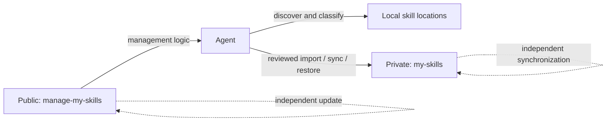

<div align="center">


# manage-my-skills

**Stop losing personal skills between machines. Let your Agent manage the library.**

One private skills library across every workstation and server, maintained through conversation.

[English](README.md) | [简体中文](docs/README.zh-CN.md) | [日本語](docs/README.ja.md)

[](https://github.com/Pursuer-Hsf/manage-my-skills/actions/workflows/ci.yml)
[](LICENSE)
[](https://www.python.org/)
[](https://agentskills.io/)

</div>

Your best skills should not disappear into old chats, random folders, or one machine you forgot to sync.

`manage-my-skills` turns scattered personal skills into a durable, private capability library. Give the project to an Agent and it handles discovery, classification, GitHub setup, safe backup, restoration, and multi-server synchronization. You describe the outcome; the Agent operates the manager.

## The Personal Skills Problem

Creating a skill is easy. Keeping a growing personal skills library healthy is not:

- Useful workflows stay buried in chats and project folders instead of becoming reusable skills.
- Copies on a laptop and several servers quietly drift into different versions.
- Backups span repositories, credentials, directories, links, and several machines.
- A new machine means rebuilding links and remembering what was installed.
- Public tools, third-party skills, and private knowledge easily become mixed together.

`manage-my-skills` gives you one private source of truth and lets the Agent do the repetitive work: discover what exists, identify what is yours, preserve it, install it on another machine, and report exactly what changed.

> **Agent-managed, human-approved.** The Agent works when asked, previews mutations, and stops for authentication, conflicts, destructive decisions, or sensitive content. It never runs a silent background push.

## Give This Repository to Your Agent

Send the repository URL to an Agent that can access your filesystem and GitHub, then say:

> Read `skills/manage-my-skills/SKILL.md` in this repository. Scan my local skills, preserve reusable personal workflows, and keep my user-owned skills synchronized through a separate private GitHub repository across my machines and servers. Preview every change first. Tell me when browser login, MFA, or approval is required.

The Agent should handle environment checks, GitHub access, private-repository verification, sensitive-content scanning, installation, synchronization, and validation. It should tell you clearly when authentication or approval is required.

## Why This Project

Popular projects such as [Vercel's skills CLI](https://github.com/vercel-labs/skills) and [OpenSkills](https://github.com/numman-ali/openskills) focus on discovering and installing skills from public or shared sources. Collections such as [Anthropic Skills](https://github.com/anthropics/skills) and [Awesome Agent Skills](https://github.com/VoltAgent/awesome-agent-skills) publish reusable skills. `manage-my-skills` complements them by managing the private, user-owned side of the lifecycle.

| Concern | Marketplace / installer | `manage-my-skills` |
| --- | --- | --- |
| Discover third-party skills | Primary use case | Classify and reference them |
| Personal workflows buried in chats and folders | Usually out of scope | Discover and preserve them as durable skills |
| Back up personal skills privately | Usually external to the tool | Core workflow |
| Several workstations and servers drift apart | Reinstall or update each target manually | One private source of truth with per-machine restore |
| GitHub onboarding for non-experts | Varies | Agent-guided |
| Verify repository is Private | Not always relevant | Required before copy or push |
| Preview before mutation | Tool-dependent | Default behavior |
| Manager and managed skills update independently | Not the usual model | Core architecture |
| Automatic conflict resolution | Tool-dependent | Intentionally refused |

## Architecture



The public repository contains generic code, documentation, tests, and sanitized examples. The private repository contains user-owned skills. Machine-specific paths live in a local state file. GitHub credentials remain under GitHub CLI or the operating system credential manager.

## Features

- Discover skills in common Codex, shared-agent, and local skill directories.
- Classify personal, shared-local, managed, and unknown skills.
- Turn reusable personal workflows into a durable private skills library instead of leaving them scattered.
- Create a new private GitHub skill library or connect an existing one.
- Import one user-owned skill only after sensitive-content and symlink checks.
- Synchronize only allowlisted paths with fast-forward-only Git behavior.
- Restore skills with a complete no-overwrite preflight and canonical symlinks.
- Diagnose Git, GitHub authentication, local state, and repository health.
- Update the public manager without touching the private skill library.
- Keep one private source of truth synchronized across workstations and multiple servers while each machine retains local state and authentication.

## How to Use

Send the repository link to your Agent, then use one of these prompts.

### First-time setup

```text
Read this repository and set up manage-my-skills.
Scan my local skills and create a private repository for my personal skills.
Preview first, and tell me when login or approval is needed.
```

### Use an existing library

```text
Connect manage-my-skills to my private skills repository OWNER/my-skills.
Check for conflicts first and do not overwrite existing skills.
```

### Routine maintenance

```text
Check and maintain my personal skills library.
Report problems first, then back up and synchronize only after I approve.
```

### Agent suggests a new skill

After a reusable task, the Agent offers:

```text
Agent: This workflow looks reusable. Save it as a personal skill?
You: Yes. Show me a sanitized preview first.
```

The Agent creates, adds, and synchronizes it only after your approval.

### Synchronize servers

```text
Connect server-a, server-b, and server-c to the same private skills library.
Check them one at a time, do not overwrite anything, and summarize the results.
```

### Restore on a new machine

```text
Restore my personal skills from OWNER/my-skills on this machine.
Check for conflicts first and do not overwrite anything.
```

### Update only the manager

```text
Update manage-my-skills only.
Do not change or synchronize my private skills library.
```

## Private Repository Format

```text
my-skills/
├── library.json
└── skills/
    └── your-skill/
        ├── SKILL.md
        ├── scripts/
        ├── references/
        └── assets/
```

Local connection state defaults to:

```text
~/.config/manage-my-skills/state.json
```

It contains repository identity, local paths, schema version, and timestamps only. It must not contain credentials.

## Safety Model

- Changes are previewed and require explicit approval.
- The skills repository must be verified as Private.
- Credentials stay in GitHub or the operating system credential store.
- Sensitive-looking content, unsafe links, conflicts, and existing targets stop the workflow.
- The manager never overwrites, force-pushes, or automatically merges.
- Third-party, marketplace, plugin, and bundled skills are references by default, not private copies.

Automated checks reduce risk but cannot prove content is safe. See [SECURITY.md](SECURITY.md).

## Compatibility and Scope

`manage-my-skills` uses the open [`SKILL.md` format](https://agentskills.io/) and is Codex-first. Other filesystem-capable Agents can use the bundled skill with Python 3.9+, Git, and GitHub access. Discovery paths and automatic behavior may differ by Agent.

## Troubleshooting

```text
Diagnose manage-my-skills. Report the cause and proposed repair before changing anything.
```

## Development

```bash
python3 -m unittest discover -s tests -v
```

The runtime has no third-party Python package dependencies.

## Contributing

Issues and focused pull requests are welcome. See [AGENTS.md](AGENTS.md).

## License

[MIT](LICENSE)
