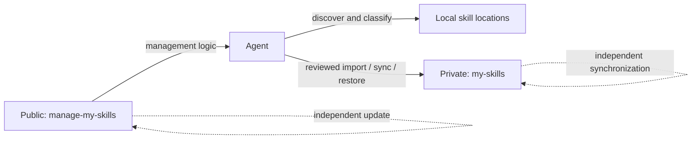

<div align="center">

# manage-my-skills

**Stop losing personal skills between machines. Let your Agent manage the library.**

One private skills library. Every workstation and server. Almost no Git work.

[English](README.md) | [简体中文](docs/README.zh-CN.md) | [日本語](docs/README.ja.md)

[](https://github.com/Pursuer-Hsf/manage-my-skills/actions/workflows/ci.yml)
[](LICENSE)
[](https://www.python.org/)
[](https://agentskills.io/)

</div>

Your best skills should not disappear into old chats, random folders, or one machine you forgot to sync.

`manage-my-skills` turns scattered personal skills into a durable, private capability library. Give the project to an Agent and it handles discovery, classification, GitHub setup, safe backup, restoration, and multi-server synchronization. You keep the valuable knowledge; the Agent handles the Git and filesystem work.

## The Personal Skills Problem

Creating a skill is easy. Keeping a growing personal skills library healthy is not:

- Useful workflows stay buried in chats and project folders instead of becoming reusable skills.
- Copies on a laptop and several servers quietly drift into different versions.
- Backups require Git knowledge, repository decisions, credentials, and careful path management.
- A new machine means rebuilding links and remembering what was installed.
- Public tools, third-party skills, and private knowledge easily become mixed together.

`manage-my-skills` gives you one private source of truth and lets the Agent do the repetitive work: discover what exists, identify what is yours, preserve it, install it on another machine, and report exactly what changed.

> **Low-friction, not unattended.** “Almost no Git work” means you do not perform routine Git and directory maintenance yourself. The Agent works when invoked, previews mutations, and asks only at security-sensitive checkpoints. It never runs a silent background push.

## Give This Repository to Your Agent

You do not need to know Git commands. Send the repository URL to an agent that can access your filesystem and GitHub, then say:

> Read `skills/manage-my-skills/SKILL.md` in this repository. Scan my local skills, preserve reusable personal workflows, and keep my user-owned skills synchronized through a separate private GitHub repository across my machines and servers. Preview every change first. Tell me when browser login, MFA, or approval is required.

The agent should handle environment checks, GitHub CLI setup, private-repository verification, sensitive-content scanning, installation, synchronization, and validation. You should only need to approve explicit changes and complete GitHub authentication in the browser.

## Why This Project

Popular projects such as [Vercel's skills CLI](https://github.com/vercel-labs/skills) and [OpenSkills](https://github.com/numman-ali/openskills) focus on discovering and installing skills from public or shared sources. Collections such as [Anthropic Skills](https://github.com/anthropics/skills) and [Awesome Agent Skills](https://github.com/VoltAgent/awesome-agent-skills) publish reusable skills. `manage-my-skills` complements them by managing the private, user-owned side of the lifecycle.

| Concern | Marketplace / installer | `manage-my-skills` |
| --- | --- | --- |
| Discover third-party skills | Primary use case | Classify and reference them |
| Personal workflows buried in chats and folders | Usually out of scope | Discover and preserve them as durable skills |
| Back up personal skills privately | Usually external to the tool | Core workflow |
| Several workstations and servers drift apart | Reinstall or update each target manually | One private source of truth with per-machine restore |
| GitHub onboarding for non-experts | Varies | Agent-guided |
| Verify repository is Private | Not always relevant | Required before copy or push |
| Preview before mutation | Tool-dependent | Default behavior |
| Manager and managed skills update independently | Not the usual model | Core architecture |
| Automatic conflict resolution | Tool-dependent | Intentionally refused |

## Architecture



The public repository contains generic code, documentation, tests, and sanitized examples. The private repository contains user-owned skills. Machine-specific paths live in a local state file. GitHub credentials remain under GitHub CLI or the operating system credential manager.

## Features

- Discover skills in common Codex, shared-agent, and local skill directories.
- Classify personal, shared-local, managed, and unknown skills.
- Turn reusable personal workflows into a durable private skills library instead of leaving them scattered.
- Create a new private GitHub skill library or connect an existing one.
- Import one user-owned skill only after sensitive-content and symlink checks.
- Synchronize only allowlisted paths with fast-forward-only Git behavior.
- Restore skills with a complete no-overwrite preflight and canonical symlinks.
- Diagnose Git, GitHub authentication, local state, and repository health.
- Update the public manager without touching the private skill library.
- Keep one private source of truth synchronized across workstations and multiple servers while each machine retains local state and authentication.

## Quick Start

### 1. Install the manager in Codex

```bash
git clone https://github.com/Pursuer-Hsf/manage-my-skills.git \
  ~/.local/share/manage-my-skills
mkdir -p ~/.codex/skills
ln -s ~/.local/share/manage-my-skills/skills/manage-my-skills \
  ~/.codex/skills/manage-my-skills
```

Restart or reload Codex, then invoke `$manage-my-skills` explicitly. The skill does not opt into implicit invocation.

### 2. Ask the Agent to set up your private library

```text
Use $manage-my-skills to scan my local skills and set up a private GitHub backup.
Preview every change and ask before applying it.
```

### 3. Confirm the result

The agent should run `doctor`, `status`, and a restore preview. A healthy installation reports authenticated GitHub access, a connected Git repository, no unexpected changes, and every managed skill link either correct or explicitly planned.

## Manual CLI

The skill is designed for Agent use, but every operation is also available as a standard-library-only Python CLI:

```bash
MANAGER="$HOME/.codex/skills/manage-my-skills/scripts/manage_my_skills.py"

python3 "$MANAGER" doctor
python3 "$MANAGER" scan
python3 "$MANAGER" status
```

| Command | Purpose | Mutates by default? |
| --- | --- | --- |
| `doctor` | Check Git, GitHub login, state, and library health | No |
| `scan` | Discover and classify local skills | No |
| `setup` | Create or clone a verified private skill library | No; requires `--apply` |
| `connect` | Connect an existing private checkout without changing it | No; requires `--apply` |
| `import` | Copy one reviewed user-owned skill into the private library | No; requires `--apply` |
| `status` | Report backed-up skills and working-tree changes | No |
| `sync` | Fetch, commit allowlisted content, and push safely | No; requires `--apply` |
| `restore` | Preflight and create missing skill links | No; requires `--apply` |
| `update-manager` | Fast-forward only the public manager checkout | No; requires `--apply` |

Run `python3 "$MANAGER" <command> --help` for complete arguments.

## Common Workflows

### Create a new private library

```bash
python3 "$MANAGER" setup \
  --repo YOUR_GITHUB_USER/my-skills \
  --library-dir ~/.local/share/my-skills

# Review the preview, then apply:
python3 "$MANAGER" setup \
  --repo YOUR_GITHUB_USER/my-skills \
  --library-dir ~/.local/share/my-skills \
  --apply
```

### Connect an existing private library

```bash
python3 "$MANAGER" connect \
  --repo YOUR_GITHUB_USER/my-skills \
  --library-dir ~/.local/share/my-skills

python3 "$MANAGER" connect \
  --repo YOUR_GITHUB_USER/my-skills \
  --library-dir ~/.local/share/my-skills \
  --apply
```

`connect` verifies GitHub privacy and records local state. It does not initialize, commit, or push repository files.

### Import and synchronize a personal skill

```bash
python3 "$MANAGER" import ~/path/to/my-skill
python3 "$MANAGER" import ~/path/to/my-skill --apply

python3 "$MANAGER" sync
python3 "$MANAGER" sync --message "Update my skill" --apply
```

Import and sync are deliberately separate. Import never implies a push.

### Restore on another machine

```bash
python3 "$MANAGER" restore \
  --repo YOUR_GITHUB_USER/my-skills \
  --library-dir ~/.local/share/my-skills \
  --target ~/.codex/skills

# Apply only after the preflight reports no conflicts:
python3 "$MANAGER" restore \
  --repo YOUR_GITHUB_USER/my-skills \
  --library-dir ~/.local/share/my-skills \
  --target ~/.codex/skills \
  --apply
```

## Private Repository Format

```text
my-skills/
├── library.json
└── skills/
    └── your-skill/
        ├── SKILL.md
        ├── scripts/
        ├── references/
        └── assets/
```

Local connection state defaults to:

```text
~/.config/manage-my-skills/state.json
```

It contains repository identity, local paths, schema version, and timestamps only. It must not contain credentials.

Do not keep private skills inside this public repository and hide them with `.gitignore`. Ignored files do not synchronize across machines and may be removed by commands such as `git clean -xfd`.

## Safety Model

- Preview is the default; mutation requires explicit `--apply`.
- GitHub must report the skill repository as Private before setup, import, sync, or restore.
- Authentication belongs to `gh` or the operating system credential store.
- Imports reject secret-like content and symlinks that escape the skill directory.
- Sync stages only `library.json` and `skills/`; it never runs `git add -A`.
- Pulls and manager updates use fast-forward-only behavior.
- Restore preflights every target before creating any link.
- Existing targets, divergent history, conflicts, force pushes, and automatic merges stop the workflow.
- Third-party, marketplace, plugin, and bundled skills are references by default, not private copies.

Pattern matching cannot prove that content is safe. Review internal hosts, personal identifiers, proprietary procedures, licenses, and confidential data before upload. See [SECURITY.md](SECURITY.md) for the full policy.

## Compatibility and Scope

`manage-my-skills` uses the open [`SKILL.md` format](https://agentskills.io/) and is Codex-first for automatic discovery and installation. Other agents can use it by reading `skills/manage-my-skills/SKILL.md` and running the CLI when they provide:

- filesystem access;
- Python 3.9 or newer;
- Git;
- GitHub CLI for verified private-repository operations;
- network and GitHub permissions.

Automatic invocation, skill search paths, hooks, and symlink support differ by agent. The project does not claim identical automatic behavior on every platform.

## Troubleshooting

Start with:

```bash
python3 "$MANAGER" doctor
```

Common actions:

- `github-login`: run `gh auth login -h github.com` and approve the browser/device flow.
- `library`: verify the configured checkout still exists and contains `.git/` and `skills/`.
- Existing restore target: inspect it manually; the manager will not replace it.
- Diverged Git history: resolve it outside the manager after making a backup.
- Skill not visible: verify the symlink and restart or reload the Agent process.

## Development

```bash
python3 -m unittest discover -s tests -v
python3 -m py_compile skills/manage-my-skills/scripts/manage_my_skills.py
python3 ~/.codex/skills/.system/skill-creator/scripts/quick_validate.py \
  skills/manage-my-skills
```

The runtime has no Python package dependencies. Development validation may require `PyYAML` for the external skill validator.

## Design References

The README structure and ecosystem terminology were informed by established projects including:

- [obra/superpowers](https://github.com/obra/superpowers) for Agent-first onboarding and platform-specific installation clarity;
- [anthropics/skills](https://github.com/anthropics/skills) and [agentskills/agentskills](https://github.com/agentskills/agentskills) for skill structure and progressive-disclosure terminology;
- [vercel-labs/skills](https://github.com/vercel-labs/skills) and [numman-ali/openskills](https://github.com/numman-ali/openskills) for CLI navigation, source/target distinctions, and symlink-based installation;
- [VoltAgent/awesome-agent-skills](https://github.com/VoltAgent/awesome-agent-skills) for explicit third-party skill security warnings.

`manage-my-skills` is independent and does not include code from those projects.

## Contributing

Issues and focused pull requests are welcome. Read [AGENTS.md](AGENTS.md) before changing safety behavior. Changes must preserve preview-by-default semantics, private-repository verification, staged-path allowlisting, and no-overwrite restore behavior.

## License

[MIT](LICENSE)
