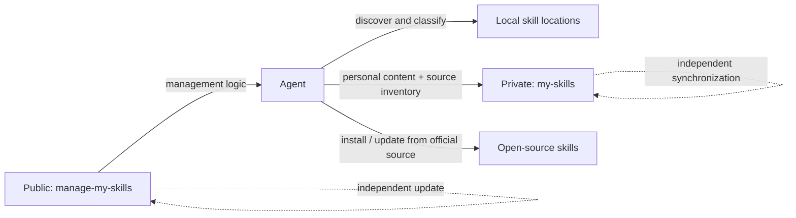

<div align="center">


# manage-my-skills

**Turn valuable Agent work into private, reviewable skills that stay current across every machine.**

Your Agent notices reusable work. You approve it once. Personal skills stay private; open-source skills stay at their original sources; every machine stays aligned. The manager checks its own updates when used.

[English](README.md) | [简体中文](docs/README.zh-CN.md) | [日本語](docs/README.ja.md)

[](https://github.com/Pursuer-Hsf/manage-my-skills/actions/workflows/ci.yml)
[](LICENSE)
[](https://www.python.org/)
[](https://agentskills.io/)

</div>

Your best workflows should not disappear into old chats, and your installed skills should not drift between machines.

`manage-my-skills` lets an Agent detect reusable work, suggest creating or updating a personal skill, keep personal and source-installed open-source skills consistent across machines, and keep the manager itself current.

## The Personal Skills Problem

Creating a skill is easy. Keeping a growing personal skills library healthy is not:

- Useful workflows stay buried in chats and project folders instead of becoming reusable skills.
- Existing personal skills miss improvements discovered in later tasks.
- Copies on a laptop and several servers quietly drift into different versions.
- Open-source skills must be rediscovered, reinstalled, and updated machine by machine.
- Backups span repositories, credentials, directories, links, and several machines.
- A new machine means rebuilding links and remembering what was installed.
- Public tools, third-party skills, and private knowledge easily become mixed together.

`manage-my-skills` gives the Agent one desired skill inventory. Personal skills synchronize as private content; open-source skills synchronize as source records and are installed or updated through their official sources.

> **Agent-managed, human-approved.** When invoked, the Agent checks the manager repository for updates and previews every mutation. It never runs a silent background update or push.

## Give This Repository to Your Agent

Send the repository URL to an Agent that can access your filesystem and GitHub, then say:

> Read `skills/manage-my-skills/SKILL.md` in this repository. Detect reusable workflows that should create or update personal skills. Keep my personal skills privately synchronized and my open-source skills installed from their canonical sources across all machines. Preview every change and tell me when approval is required.

The Agent should handle environment checks, GitHub access, private-repository verification, sensitive-content scanning, installation, synchronization, and validation. It should tell you clearly when authentication or approval is required.

## Why This Project

Popular projects such as [Vercel's skills CLI](https://github.com/vercel-labs/skills) and [OpenSkills](https://github.com/numman-ali/openskills) focus on discovering and installing public skills. `manage-my-skills` complements them with personal-skill preservation and one cross-machine inventory for both personal and source-installed skills.

| Concern | Marketplace / installer | `manage-my-skills` |
| --- | --- | --- |
| Discover third-party skills | Primary use case | Track their source, path, and version |
| Personal workflows buried in chats and folders | Usually out of scope | Discover and preserve them as durable skills |
| Back up personal skills privately | Usually external to the tool | Core workflow |
| Several workstations and servers drift apart | Reinstall or update each target manually | Reconcile personal and open-source skills on each machine |
| GitHub onboarding for non-experts | Varies | Agent-guided |
| Verify repository is Private | Not always relevant | Required before copy or push |
| Preview before mutation | Tool-dependent | Default behavior |
| Manager and managed skills update independently | Not the usual model | Core architecture |
| Automatic conflict resolution | Tool-dependent | Intentionally refused |

## Architecture



The public repository contains the manager. The private repository contains personal skills and a portable inventory of open-source sources. Machine-specific paths and credentials stay local.

## Features

- Discover skills in common Codex, shared-agent, and local skill directories.
- Classify personal, shared-local, managed, and unknown skills.
- Automatically suggest creating a new personal skill or updating an existing one when reusable value appears.
- Create a new private GitHub skill library or connect an existing one.
- Import one user-owned skill only after sensitive-content and symlink checks.
- Track open-source, marketplace, and plugin skills by canonical source, path, and optional version.
- Reinstall or update source-managed skills through their official mechanism on each machine.
- Synchronize only allowlisted paths with fast-forward-only Git behavior.
- Restore skills with a complete no-overwrite preflight and canonical symlinks.
- Diagnose Git, GitHub authentication, local state, and repository health.
- Check the public manager for updates when invoked and fast-forward it without touching managed skills.
- Keep one private source of truth synchronized across workstations and multiple servers while each machine retains local state and authentication.

## How to Use

Send the repository link to your Agent, then use one of these prompts.

### First-time setup

```text
Read this repository and set up manage-my-skills.
Inventory my personal and open-source skills, then create the private management repository.
Preview first, and tell me when login or approval is needed.
```

### Use an existing library

```text
Connect manage-my-skills to my private skills repository OWNER/my-skills.
Check for conflicts first and do not overwrite existing skills.
```

### Routine maintenance

```text
Check and maintain all my skills.
Suggest personal skills to create or update, and report open-source installation or version drift.
Also check whether manage-my-skills itself needs an update.
Make changes only after I approve.
```

### Agent suggests capture or update

After a reusable task, the Agent offers:

```text
Agent: This workflow can improve your existing xxx skill. Update it?
You: Yes. Show me the sanitized changes first.
```

If no related skill exists, the Agent suggests creating one instead. Nothing changes before approval.

### Synchronize servers

```text
Keep skills consistent across server-a, server-b, and server-c.
Check manage-my-skills for updates on each machine first.
Sync personal skills privately; install or update open-source skills from their official sources.
Check one machine at a time, do not overwrite anything, and summarize the results.
```

### Restore on a new machine

```text
Restore my managed skills from OWNER/my-skills on this machine.
Restore personal skills and reinstall or update open-source skills from their recorded sources.
Check for conflicts first and do not overwrite anything.
```

### Update only the manager

```text
Check manage-my-skills for updates and show me the plan.
Update it only after I approve.
Do not change or synchronize my private skills library.
```

## Private Repository Format

```text
my-skills/
├── library.json
└── skills/
    └── your-skill/
        ├── SKILL.md
        ├── scripts/
        ├── references/
        └── assets/
```

`library.json` keeps the portable inventory for source-managed skills. It stores identifiers, paths, and optional refs, never executable installation commands.

Local connection state defaults to:

```text
~/.config/manage-my-skills/state.json
```

It contains repository identity, local paths, schema version, and timestamps only. It must not contain credentials.

## Safety Model

- Changes are previewed and require explicit approval.
- The skills repository must be verified as Private.
- Credentials stay in GitHub or the operating system credential store.
- Sensitive-looking content, unsafe links, conflicts, and existing targets stop the workflow.
- The manager never overwrites, force-pushes, or automatically merges.
- The public manager updates only by fast-forward and stops on local changes or divergent history.
- Open-source, marketplace, plugin, and bundled skills keep their original update authority; only portable source metadata is synchronized.

Automated checks reduce risk but cannot prove content is safe. See [SECURITY.md](SECURITY.md).

## Compatibility and Scope

`manage-my-skills` uses the open [`SKILL.md` format](https://agentskills.io/) and is Codex-first. Other filesystem-capable Agents can use the bundled skill with Python 3.9+, Git, and GitHub access. Discovery paths and automatic behavior may differ by Agent.

## Troubleshooting

```text
Diagnose manage-my-skills. Report the cause and proposed repair before changing anything.
```

## Development

```bash
python3 -m unittest discover -s tests -v
```

The runtime has no third-party Python package dependencies.

## Contributing

Issues and focused pull requests are welcome. Start with [CONTRIBUTING.md](CONTRIBUTING.md), then read [AGENTS.md](AGENTS.md) and the [Code of Conduct](CODE_OF_CONDUCT.md).

## License

[MIT](LICENSE)
