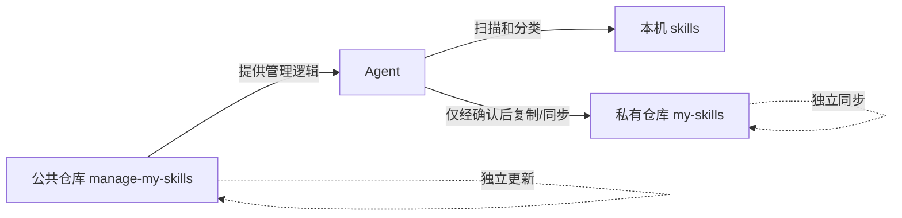

# manage-my-skills

`manage-my-skills` 是一个给 Agent 使用的开源管理 skill：它发现和归类本机 skills，并指导用户把自己维护的 skills 安全备份到**另一个私有 GitHub 仓库**。

公共管理器与私人技能库彼此独立。更新本项目不会改动正在维护的 skills；同步私人 skills 也不会改动管理器。

## 告诉 Agent 即可开始

把本仓库 URL 告诉能够访问 GitHub 和本机文件的 Agent：

> 阅读此仓库的 `skills/manage-my-skills/SKILL.md`，帮我扫描本地 skills，并建立一个私有 GitHub 仓库进行安全管理。修改前先预览；需要登录、MFA 或授权时告诉我。

Agent 应负责检查 Git、安装或调用 GitHub CLI、解释每一步、创建并验证私有仓库、扫描敏感内容和执行测试。用户只需要在浏览器中完成 GitHub 登录、MFA 和明确授权。

## 安装到 Codex

```bash
git clone https://github.com/OWNER/manage-my-skills.git
ln -s "$(pwd)/manage-my-skills/skills/manage-my-skills" ~/.codex/skills/manage-my-skills
```

重启或重新载入 Codex 后，可显式调用 `$manage-my-skills`。本 skill 默认不隐式注入每个任务。

## 工作方式



核心命令位于 `skills/manage-my-skills/scripts/manage_my_skills.py`：

- `doctor`：检查 Git、GitHub 登录、状态文件和私人库。
- `scan`：发现并初步归类本机 skills。
- `setup`：创建或连接经过验证的私有 GitHub 仓库。
- `import`：把一个经审查的自有 skill 导入私人库，但不自动推送。
- `status`：显示备份数量和未同步变化。
- `sync`：只提交白名单路径，并在无冲突时推送。
- `restore`：在新机器克隆私人库并建立链接，不覆盖现有内容。
- `update-manager`：只更新公共管理器。

所有会修改数据的命令默认只预览，必须明确添加 `--apply`。

## 私人仓库格式

```text
my-skills/
├── library.json
└── skills/
    └── your-skill/
        └── SKILL.md
```

不要把私人 skills 放进本公共仓库后再用 `.gitignore` 隐藏。它们不会跨机器同步，还可能被 `git clean -xfd` 删除。

## 安全边界

- 不存储 GitHub token；认证交给 `gh` 和系统凭据管理器。
- 设置和同步前重新查询 GitHub，远程不是 Private 就停止。
- 上传前扫描私钥、token、access key 和明显密码赋值。
- 不使用 `git add -A`、force push、自动合并或自动冲突解决。
- 不覆盖恢复目标，不自动删除 skills。
- 第三方、官方市场和插件 skills 默认只记录来源，不复制进入私人仓库。

详见 [SECURITY.md](SECURITY.md)。

## 开发

```bash
python3 -m unittest discover -s tests -v
python3 ~/.codex/skills/.system/skill-creator/scripts/quick_validate.py skills/manage-my-skills
```

项目只依赖 Python 标准库、Git 和 GitHub CLI。
