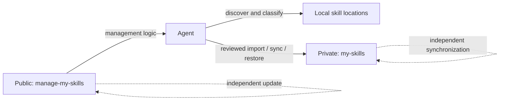

<div align="center">

# manage-my-skills

**Stop losing personal skills between machines. Let your Agent manage the library.**

One private skills library across every workstation and server, maintained through conversation.

[English](README.md) | [简体中文](docs/README.zh-CN.md) | [日本語](docs/README.ja.md)

[](https://github.com/Pursuer-Hsf/manage-my-skills/actions/workflows/ci.yml)
[](LICENSE)
[](https://www.python.org/)
[](https://agentskills.io/)

</div>

Your best skills should not disappear into old chats, random folders, or one machine you forgot to sync.

`manage-my-skills` turns scattered personal skills into a durable, private capability library. Give the project to an Agent and it handles discovery, classification, GitHub setup, safe backup, restoration, and multi-server synchronization. You describe the outcome; the Agent operates the manager.

## The Personal Skills Problem

Creating a skill is easy. Keeping a growing personal skills library healthy is not:

- Useful workflows stay buried in chats and project folders instead of becoming reusable skills.
- Copies on a laptop and several servers quietly drift into different versions.
- Backups span repositories, credentials, directories, links, and several machines.
- A new machine means rebuilding links and remembering what was installed.
- Public tools, third-party skills, and private knowledge easily become mixed together.

`manage-my-skills` gives you one private source of truth and lets the Agent do the repetitive work: discover what exists, identify what is yours, preserve it, install it on another machine, and report exactly what changed.

> **Agent-managed, human-approved.** The Agent works when asked, previews mutations, and stops for authentication, conflicts, destructive decisions, or sensitive content. It never runs a silent background push.

## Give This Repository to Your Agent

Send the repository URL to an Agent that can access your filesystem and GitHub, then say:

> Read `skills/manage-my-skills/SKILL.md` in this repository. Scan my local skills, preserve reusable personal workflows, and keep my user-owned skills synchronized through a separate private GitHub repository across my machines and servers. Preview every change first. Tell me when browser login, MFA, or approval is required.

The Agent should handle environment checks, GitHub access, private-repository verification, sensitive-content scanning, installation, synchronization, and validation. It should tell you clearly when authentication or approval is required.

## Why This Project

Popular projects such as [Vercel's skills CLI](https://github.com/vercel-labs/skills) and [OpenSkills](https://github.com/numman-ali/openskills) focus on discovering and installing skills from public or shared sources. Collections such as [Anthropic Skills](https://github.com/anthropics/skills) and [Awesome Agent Skills](https://github.com/VoltAgent/awesome-agent-skills) publish reusable skills. `manage-my-skills` complements them by managing the private, user-owned side of the lifecycle.

| Concern | Marketplace / installer | `manage-my-skills` |
| --- | --- | --- |
| Discover third-party skills | Primary use case | Classify and reference them |
| Personal workflows buried in chats and folders | Usually out of scope | Discover and preserve them as durable skills |
| Back up personal skills privately | Usually external to the tool | Core workflow |
| Several workstations and servers drift apart | Reinstall or update each target manually | One private source of truth with per-machine restore |
| GitHub onboarding for non-experts | Varies | Agent-guided |
| Verify repository is Private | Not always relevant | Required before copy or push |
| Preview before mutation | Tool-dependent | Default behavior |
| Manager and managed skills update independently | Not the usual model | Core architecture |
| Automatic conflict resolution | Tool-dependent | Intentionally refused |

## Architecture



The public repository contains generic code, documentation, tests, and sanitized examples. The private repository contains user-owned skills. Machine-specific paths live in a local state file. GitHub credentials remain under GitHub CLI or the operating system credential manager.

## Features

- Discover skills in common Codex, shared-agent, and local skill directories.
- Classify personal, shared-local, managed, and unknown skills.
- Turn reusable personal workflows into a durable private skills library instead of leaving them scattered.
- Create a new private GitHub skill library or connect an existing one.
- Import one user-owned skill only after sensitive-content and symlink checks.
- Synchronize only allowlisted paths with fast-forward-only Git behavior.
- Restore skills with a complete no-overwrite preflight and canonical symlinks.
- Diagnose Git, GitHub authentication, local state, and repository health.
- Update the public manager without touching the private skill library.
- Keep one private source of truth synchronized across workstations and multiple servers while each machine retains local state and authentication.

## Conversation Guides

The repository is the instruction manual for the Agent. Describe the result you want; the Agent reads the bundled skill and operates the internal tooling.

### Start from zero

**You:**

> Read this repository and install `manage-my-skills`. Scan my local skills, classify which ones are mine, and create a private GitHub repository named `my-skills` for them. Preview the repository, paths, and planned changes first. Tell me when I need to sign in or approve anything.

**The Agent should:** inspect the environment, explain its classification, request GitHub authentication only when needed, verify that the repository is Private, show a complete preview, and wait for your approval before changing anything.

### Connect an existing private library

**You:**

> My existing private skills repository is `OWNER/my-skills`. Connect this machine to it without rewriting its history or replacing any existing local skill. Show conflicts before making changes.

**The Agent should:** verify the repository identity and privacy, inspect the existing checkout, record only machine-local configuration, and preflight every skill destination.

### Maintain the library

**You:**

> Check my personal skills library. Find local skills that are not backed up, private-library changes that are not synchronized, broken links, and machine drift. Report problems first; do not modify anything yet.

After reviewing the report:

> Back up the reviewed personal skills and synchronize the private library. Stop if you find sensitive content, a conflict, or divergent history.

### Preserve a reusable workflow as a skill

**You:**

> Turn the reusable parts of this task into a personal skill. Show me the proposed skill name, scope, files, and any sensitive information that must be removed. After I approve the content, add it to my private library and synchronize it.

`manage-my-skills` governs storage, validation, and synchronization. The Agent may use an appropriate skill-authoring workflow to create or update the skill before handing it to the manager.

### Synchronize several servers

**You:**

> Connect servers `server-a`, `server-b`, and `server-c` to the same private skills library. Handle them one at a time, preview each machine, and do not overwrite existing skills. Tell me when SSH access or GitHub device authorization is required, then give me a final machine-by-machine report.

Each machine keeps its own local paths and credentials. Cross-machine work happens only when explicitly requested; the manager is not a background deployment service.

### Restore on a new machine

**You:**

> Restore my personal skills on this new machine from `OWNER/my-skills`. First inspect the environment and preview every destination. Do not replace any existing file or skill.

**The Agent should:** install or update the public manager independently, authenticate GitHub if necessary, verify the private source, stop on any destination conflict, and report what was restored.

### Update only the manager

**You:**

> Update `manage-my-skills`, but do not import, synchronize, or modify anything in my private skills library.

The public manager and private library have independent lifecycles, so updating one must not silently mutate the other.

## Private Repository Format

```text
my-skills/
├── library.json
└── skills/
    └── your-skill/
        ├── SKILL.md
        ├── scripts/
        ├── references/
        └── assets/
```

Local connection state defaults to:

```text
~/.config/manage-my-skills/state.json
```

It contains repository identity, local paths, schema version, and timestamps only. It must not contain credentials.

Do not keep private skills inside this public repository and hide them with `.gitignore`. Ignored files do not synchronize across machines and may be removed by commands such as `git clean -xfd`.

## Safety Model

- Every mutation is previewed and requires explicit user approval.
- GitHub must report the skill repository as Private before setup, import, sync, or restore.
- Authentication belongs to `gh` or the operating system credential store.
- Imports reject secret-like content and symlinks that escape the skill directory.
- Sync stages only `library.json` and `skills/`; it never runs `git add -A`.
- Pulls and manager updates use fast-forward-only behavior.
- Restore preflights every target before creating any link.
- Existing targets, divergent history, conflicts, force pushes, and automatic merges stop the workflow.
- Third-party, marketplace, plugin, and bundled skills are references by default, not private copies.

Pattern matching cannot prove that content is safe. Review internal hosts, personal identifiers, proprietary procedures, licenses, and confidential data before upload. See [SECURITY.md](SECURITY.md) for the full policy.

## Compatibility and Scope

`manage-my-skills` uses the open [`SKILL.md` format](https://agentskills.io/) and is Codex-first for automatic discovery and installation. Other Agents can use it by reading `skills/manage-my-skills/SKILL.md` and operating the bundled manager when they provide:

- filesystem access;
- Python 3.9 or newer;
- Git;
- GitHub CLI for verified private-repository operations;
- network and GitHub permissions.

Automatic invocation, skill search paths, hooks, and symlink support differ by agent. The project does not claim identical automatic behavior on every platform.

## Troubleshooting

Ask the Agent:

> Diagnose my `manage-my-skills` installation. Check authentication, local state, repository privacy, links, and synchronization status. Report the cause and proposed repair before changing anything.

Common actions:

- GitHub authentication: let the Agent start the browser or device flow, then approve it when prompted.
- `library`: verify the configured checkout still exists and contains `.git/` and `skills/`.
- Existing restore target: inspect it manually; the manager will not replace it.
- Diverged Git history: resolve it outside the manager after making a backup.
- Skill not visible: verify the symlink and restart or reload the Agent process.

## Development

```bash
python3 -m unittest discover -s tests -v
python3 -m py_compile skills/manage-my-skills/scripts/manage_my_skills.py
python3 ~/.codex/skills/.system/skill-creator/scripts/quick_validate.py \
  skills/manage-my-skills
```

The runtime has no Python package dependencies. Development validation may require `PyYAML` for the external skill validator.

## Design References

The README structure and ecosystem terminology were informed by established projects including:

- [obra/superpowers](https://github.com/obra/superpowers) for Agent-first onboarding and platform-specific installation clarity;
- [anthropics/skills](https://github.com/anthropics/skills) and [agentskills/agentskills](https://github.com/agentskills/agentskills) for skill structure and progressive-disclosure terminology;
- [vercel-labs/skills](https://github.com/vercel-labs/skills) and [numman-ali/openskills](https://github.com/numman-ali/openskills) for CLI navigation, source/target distinctions, and symlink-based installation;
- [VoltAgent/awesome-agent-skills](https://github.com/VoltAgent/awesome-agent-skills) for explicit third-party skill security warnings.

`manage-my-skills` is independent and does not include code from those projects.

## Contributing

Issues and focused pull requests are welcome. Read [AGENTS.md](AGENTS.md) before changing safety behavior. Changes must preserve preview-by-default semantics, private-repository verification, staged-path allowlisting, and no-overwrite restore behavior.

## License

[MIT](LICENSE)
