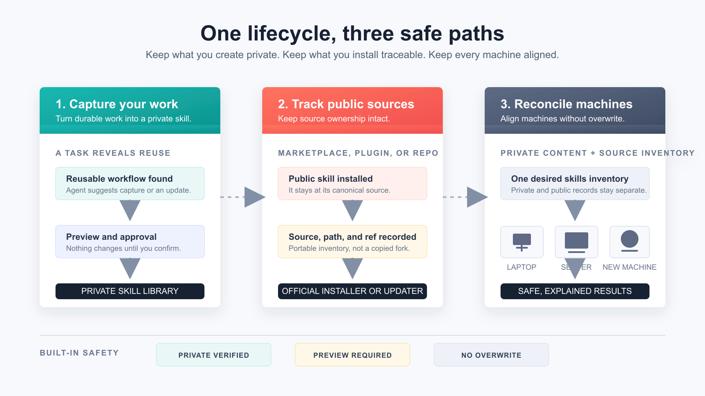
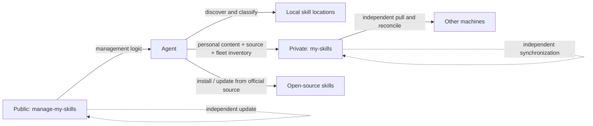

<div align="center">


# manage-my-skills

**The lifecycle manager for personal Agent skills.**

Turn reusable work into private skills. Keep public skills tied to their sources. Reconcile both safely across every machine.

[English](README.md) | [简体中文](docs/README.zh-CN.md) | [日本語](docs/README.ja.md)

[](https://github.com/Pursuer-Hsf/manage-my-skills/actions/workflows/ci.yml)
[](LICENSE)
[](https://www.python.org/)
[](https://agentskills.io/)

</div>

Most skill tools help you install something on one machine. They do not answer the harder questions: which Agent knowledge is truly yours, how should it improve, and what should safely exist on every machine you use.

`manage-my-skills` gives an Agent one lifecycle for both kinds of skills. It suggests creating or updating personal skills when work becomes reusable, keeps that knowledge in a private library, records public skills by source instead of copying them, and reconciles the desired state on every machine.

## Three Paths, One Inventory



| What happens | How the manager handles it | What you keep |
| --- | --- | --- |
| A task produces a workflow worth reusing | The Agent proposes a sanitized preview; you approve before a private skill is saved or updated | Personal knowledge that is reviewable and can evolve |
| You install a marketplace, plugin, or open-source skill | It records the canonical source, path, and optional ref instead of copying the skill to your private library | Provenance, licensing boundaries, and the original update authority |
| You add a laptop, workstation, or server | It synchronizes private content and reconciles public skills through their official sources | The right skills on each machine without guessing paths or overwriting work |

The goal is not to copy every skill directory everywhere. It is to let every machine safely reach the same desired skills state. GitHub is the shared hub: machines do not need SSH access to one another.

> **Agent-managed, human-approved.** When invoked, the Agent checks the manager repository for updates and previews every mutation. It never runs a silent background update or push.

## The Problem Starts After Installation

Creating or installing a skill is easy. Keeping a growing personal skills system healthy is not:

- Useful workflows stay buried in chats and project folders instead of becoming reusable skills.
- Existing personal skills miss improvements discovered in later tasks.
- Copies on a laptop and several servers quietly drift into different versions.
- Open-source skills must be rediscovered, reinstalled, and updated machine by machine.
- Backups span repositories, credentials, directories, links, and several machines.
- A new machine means rebuilding links and remembering what was installed.
- Public tools, third-party skills, and private knowledge easily become mixed together, even though they need different ownership and update rules.

`manage-my-skills` gives the Agent one desired skill inventory. Personal skills synchronize as private content; open-source skills synchronize as source records and are installed or updated through their official sources.

## Give This Repository to Your Agent

Send the repository URL to an Agent that can access your filesystem and GitHub, then say:

> Read `skills/manage-my-skills/SKILL.md` in this repository. Detect reusable workflows that should create or update personal skills. Keep my personal skills privately synchronized and my open-source skills installed from their canonical sources across all machines. Preview every change and tell me when approval is required.

The Agent should handle environment checks, GitHub access, private-repository verification, sensitive-content scanning, installation, synchronization, and validation. It should tell you clearly when authentication or approval is required.

## A Different Layer From Installers

Projects such as [Vercel's skills CLI](https://github.com/vercel-labs/skills) and [OpenSkills](https://github.com/numman-ali/openskills) focus on discovering, loading, installing, and updating skills. `manage-my-skills` complements those tools: it manages the ownership, provenance, evolution, and cross-machine state of the skills a person actually depends on.

| The question | Marketplace / installer | `manage-my-skills` |
| --- | --- | --- |
| How do I add a public skill here? | Discover and install it | Track its canonical source after installation |
| How does a useful task become reusable knowledge? | Usually outside the installer workflow | Suggest a private skill capture or update with a reviewable preview |
| How do private and public skills coexist? | Local files and source copies | Private content stays private; public skills remain source-managed |
| How do I equip a new machine safely? | Reinstall and reconstruct paths manually | Restore private skills and reconcile the source inventory without overwrite |
| Can I delegate maintenance to an Agent? | Tool-dependent | Private-repository verification, sensitive-content checks, previews, and explicit approval |
| Can the manager update without changing my skills? | Not the usual model | Public manager and private library update independently |

## Architecture



The public repository contains the manager. The private repository contains personal skills, a portable inventory of open-source sources, and optional safe machine labels. Machine-specific paths, credentials, and connection details stay local. Each machine reaches GitHub independently, so a server does not need to reach another server. This control-plane separation lets the manager update independently without silently changing personal skills.

## Features

- Discover skills in common Codex, shared-agent, and local skill directories.
- Classify personal, shared-local, managed, and unknown skills.
- Automatically suggest creating a new personal skill or updating an existing one when reusable value appears.
- Bootstrap a private library on the first machine, then join additional machines independently through GitHub.
- Import one user-owned skill only after sensitive-content and symlink checks.
- Adopt an existing personal skill with a preserved local backup before replacing it with a managed link.
- Track open-source, marketplace, and plugin skills by canonical source, path, and optional version.
- Reinstall or update source-managed skills through their official mechanism on each machine.
- Synchronize only allowlisted paths with fast-forward-only Git behavior.
- Restore skills with a complete no-overwrite preflight and canonical symlinks.
- Diagnose Git, GitHub authentication, local state, and repository health.
- Check the public manager for updates when invoked and fast-forward it without touching managed skills.
- Keep one private source of truth synchronized across workstations and multiple servers while each machine retains its own identity, paths, and authentication.

## How to Use

Send the repository link to your Agent, then use one of these prompts.

### First-time setup

```text
Read this repository and set up manage-my-skills.
Inventory my personal and open-source skills, then create the private management repository.
Register this machine, but do not replace or import any existing skill until I approve.
Preview first, and tell me when login or approval is needed.
```

### Use an existing library

```text
Connect manage-my-skills to my private skills repository OWNER/my-skills.
Check for conflicts first and do not overwrite existing skills.
```

### Add another machine

```text
Set up manage-my-skills on this machine and join OWNER/my-skills.
Register this machine as worker-a, then preview restoration and public-skill reconciliation.
This machine may only reach GitHub. Do not assume it can SSH to other machines.
```

### Routine maintenance

```text
Check and maintain all my skills.
Suggest personal skills to create or update, and report open-source installation or version drift.
Also check whether manage-my-skills itself needs an update.
Make changes only after I approve.
```

### Agent suggests capture or update

After a reusable task, the Agent offers:

```text
Agent: This workflow can improve your existing xxx skill. Update it?
You: Yes. Show me the sanitized changes first.
```

If no related skill exists, the Agent suggests creating one instead. Nothing changes before approval.

### Synchronize servers

```text
Keep skills consistent across server-a, server-b, and server-c.
Use the private library as the shared hub; do not assume servers can reach one another.
On each machine, check the manager, local registration, personal links, and public sources.
Preview every repair, do not overwrite anything, and summarize the local results.
```

### Restore on a new machine

```text
Join this machine to OWNER/my-skills, then restore my managed skills.
Restore personal skills and reinstall or update open-source skills from their recorded sources.
Check for conflicts first and do not overwrite anything.
```

### Update only the manager

```text
Check manage-my-skills for updates and show me the plan.
Update it only after I approve.
Do not change or synchronize my private skills library.
```

## Private Repository Format

```text
my-skills/
├── library.json
├── fleet.json        # optional safe machine IDs, labels, and roles
└── skills/
    └── your-skill/
        ├── SKILL.md
        ├── scripts/
        ├── references/
        └── assets/
```

`library.json` keeps the portable inventory for source-managed skills. It stores identifiers, paths, and optional refs, never executable installation commands. Optional `fleet.json` lists only random machine IDs, safe labels, roles, and enabled state. It never stores hostnames, IP addresses, SSH aliases, paths, or credentials.

Local connection state defaults to:

```text
~/.config/manage-my-skills/state.json
```

It contains repository identity, local paths, schema version, timestamps, and the local machine's random ID and safe label. It must not contain credentials.

## Safety Model

- Changes are previewed and require explicit approval.
- The skills repository must be verified as Private.
- An existing local checkout must point to that verified repository.
- Credentials stay in GitHub or the operating system credential store.
- Sensitive-looking content, unsafe links, conflicts, and existing targets stop the workflow.
- The manager never overwrites, force-pushes, or automatically merges.
- The public manager updates only by fast-forward and stops on local changes or divergent history.
- Open-source, marketplace, plugin, and bundled skills keep their original update authority; only portable source metadata is synchronized.
- Fleet registration stores no connection details. A local check describes only the current machine unless a separate reporting channel is configured.

Automated checks reduce risk but cannot prove content is safe. See [SECURITY.md](SECURITY.md).

## Compatibility and Scope

`manage-my-skills` uses the open [`SKILL.md` format](https://agentskills.io/) and is Codex-first. Other filesystem-capable Agents can use the bundled skill with Python 3.9+, Git, and GitHub access. Each machine needs its own GitHub access; SSH between machines is optional and never required for synchronization. Discovery paths and automatic behavior may differ by Agent.

## Troubleshooting

```text
Diagnose manage-my-skills. Report the cause and proposed repair before changing anything.
```

## Development

```bash
python3 -m unittest discover -s tests -v
```

The runtime has no third-party Python package dependencies.

## Contributing

Issues and focused pull requests are welcome. Start with [CONTRIBUTING.md](CONTRIBUTING.md), then read [AGENTS.md](AGENTS.md) and the [Code of Conduct](CODE_OF_CONDUCT.md).

## License

[MIT](LICENSE)
