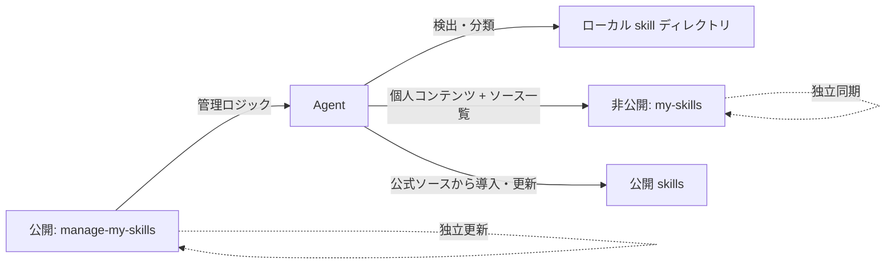

<div align="center">


# manage-my-skills

**価値ある Agent の作業を確認可能な非公開 skill として残し、すべてのマシンで最新の状態に保ちます。**

Agent が再利用可能な作業を見つけ、あなたは一度だけ承認します。個人 skills は非公開のまま、公開 skills は元のソースに従い、すべてのマシンを一致させます。

[English](../README.md) | [简体中文](README.zh-CN.md) | [日本語](README.ja.md)

[](https://github.com/Pursuer-Hsf/manage-my-skills/actions/workflows/ci.yml)
[](../LICENSE)
[](https://www.python.org/)
[](https://agentskills.io/)

</div>

本当の難しさは skill を書くことではなく、蓄積・更新すべき経験を見つけ、すべてのマシンで skills を一致させ続けることです。

`manage-my-skills` は再利用可能な手順を検出し、新しい個人 skill の作成や既存 skill の更新を提案します。個人 skills とソース管理された公開 skills を複数マシンで統一し、マネージャー自身の更新も確認します。

## 個人 skills 管理の悩み

skill を 1 つ作るのは簡単でも、増え続ける skills 全体の維持は簡単ではありません。

- 有用な手順が古いチャットやプロジェクトに埋もれ、再利用可能な skill として残らない。
- 後の作業で改善点が見つかっても、既存 skill が更新されない。
- ノート PC と複数サーバーのコピーが、気付かないうちに別バージョンになる。
- 公開 skills をマシンごとに探し直し、インストール・更新する必要がある。
- バックアップはリポジトリ、認証情報、パス、リンク、複数マシンにまたがる。
- 新しいマシンでは、何をどこにインストールしたかを思い出して再構築する必要がある。
- 公開ツール、サードパーティ skills、個人の非公開知識が混在しやすい。

`manage-my-skills` は統一された skills インベントリを Agent に提供します。個人 skills は非公開コンテンツとして同期し、公開 skills はソース情報を同期して各マシンで公式ソースから導入・更新します。

> **Agent が管理し、ユーザーが承認します。** 呼び出し時にマネージャーの更新を確認し、すべての変更を先にプレビューします。バックグラウンドで無断更新や push は行いません。

## このリポジトリを Agent に渡すだけで開始

ファイルシステムと GitHub にアクセスできる Agent にリポジトリ URL を渡し、次のように依頼します。

> このリポジトリの `skills/manage-my-skills/SKILL.md` を読んでください。新規作成または更新すべき個人 skill を自動検出し、個人 skills は非公開で同期、公開 skills は元のソースから導入・更新して、すべてのマシンで一致させてください。変更は先にプレビューしてください。

Agent は環境確認、GitHub アクセス、非公開リポジトリの検証、機密情報のスキャン、インストール、同期、検証を担当し、認証や承認が必要な場合は明確に知らせます。

## このプロジェクトの役割

[Vercel skills CLI](https://github.com/vercel-labs/skills) や [OpenSkills](https://github.com/numman-ali/openskills) は、主に公開 skills の検索とインストールを扱います。`manage-my-skills` は個人 skill の蓄積と、個人・公開 skills のマシン横断管理を加えます。

| 観点 | マーケットプレイス / インストーラー | `manage-my-skills` |
| --- | --- | --- |
| サードパーティ skills の検索 | 主用途 | ソース、パス、バージョンを記録 |
| チャットやプロジェクトに埋もれた個人手順 | 通常は対象外 | 検出し、長期利用できる skills として蓄積 |
| 個人 skills の非公開バックアップ | 通常は外部フロー | 中核機能 |
| 端末と複数サーバーのバージョンずれ | 各ターゲットを個別に再導入・更新 | 個人・公開 skills をマシンごとに整合 |
| GitHub 初心者向け導入 | ツールごとに異なる | Agent が案内 |
| Private 設定の確認 | 常に必要とは限らない | コピー・push 前に必須 |
| 変更前プレビュー | ツール依存 | デフォルト |
| マネージャーと skills の独立更新 | 一般的な中心設計ではない | 中核アーキテクチャ |
| Git 競合の自動解決 | ツール依存 | 意図的に拒否 |

## アーキテクチャ



公開リポジトリにはマネージャーを置きます。非公開リポジトリには個人 skills と移植可能な公開ソース一覧を置き、マシン固有パスと認証情報はローカルだけに保存します。

## 主な機能

- Codex、共有 Agent、一般的なローカル skill ディレクトリを検出。
- skills を personal、shared-local、managed、unknown に分類。
- 再利用価値を検出し、新しい個人 skill の作成または既存 skill の更新を提案。
- 新しい非公開 GitHub skill ライブラリの作成、または既存ライブラリへの接続。
- 機密情報とディレクトリ外 symlink を確認してから、ユーザー所有 skill を 1 件ずつ import。
- 公開、マーケットプレイス、プラグイン skills のソース、パス、任意バージョンを記録。
- 各マシンで公式の方法を使ってソース管理 skills を導入・更新。
- 許可されたパスだけを、fast-forward-only の Git 動作で同期。
- 全ターゲットを事前確認し、上書きなしで symlink を復元。
- Git、GitHub 認証、ローカル状態、リポジトリ状態を診断。
- 呼び出し時に公開マネージャーを確認し、安全な fast-forward だけで更新。
- 1 つの非公開ソースを端末と複数サーバーで同期しつつ、各マシンは独自の状態と認証を保持。

## 使い方

リポジトリのリンクを Agent に渡し、目的に合う一文を送ります。

### 初回設定

```text
このリポジトリを読んで manage-my-skills を設定してください。
個人 skills と公開 skills を確認し、非公開の管理リポジトリを作成してください。
先にプレビューし、ログインや承認が必要なら知らせてください。
```

### 既存ライブラリを使う

```text
manage-my-skills を非公開 skills リポジトリ OWNER/my-skills に接続してください。
先に競合を確認し、既存 skills は上書きしないでください。
```

### 日常メンテナンス

```text
すべての skills を確認して管理してください。
新規作成・更新すべき個人 skill と、公開 skills の導入・バージョン差異を報告してください。
manage-my-skills 自身の更新も確認してください。
承認後に変更してください。
```

### Agent から新規作成・更新を提案

再利用できる作業が完了すると、Agent が次のように提案します。

```text
Agent: この手順は既存の xxx skill を改善できます。更新しますか？
あなた: はい。先に匿名化した変更を見せてください。
```

対応する skill がなければ、新規作成を提案します。承認前に変更は行いません。

### 複数サーバーを同期

```text
server-a、server-b、server-c の skills を一致させてください。
各マシンの manage-my-skills を先に確認・更新してください。
個人 skills は非公開同期し、公開 skills は公式ソースから導入・更新してください。
1 台ずつ確認し、上書きせず、最後に結果をまとめてください。
```

### 新しいマシンで復元

```text
OWNER/my-skills からこのマシンへ管理対象 skills を復元してください。
個人 skills を復元し、公開 skills は記録されたソースから再導入・更新してください。
先に競合を確認し、既存の内容は上書きしないでください。
```

### マネージャーだけを更新

```text
manage-my-skills の更新を確認し、計画を先に表示してください。
承認後、マネージャーだけを更新してください。
非公開 skills ライブラリは変更・同期しないでください。
```

## 非公開リポジトリ形式

```text
my-skills/
├── library.json
└── skills/
    └── your-skill/
        ├── SKILL.md
        ├── scripts/
        ├── references/
        └── assets/
```

`library.json` はソース管理 skills の移植可能な一覧を保持し、識別子、パス、任意の ref だけを記録します。実行可能なインストールコマンドは保存しません。

ローカル接続状態の既定パス：

```text
~/.config/manage-my-skills/state.json
```

ここにはリポジトリ識別子、ローカルパス、schema バージョン、タイムスタンプだけを保存し、認証情報は保存しません。

## セキュリティモデル

- 変更は事前にプレビューし、明示的な承認を得ます。
- skills リポジトリが Private であることを検証します。
- 認証情報は GitHub または OS の認証情報ストアに保存します。
- 機密情報らしい内容、危険なリンク、競合、既存ターゲットがある場合は停止します。
- 上書き、force push、自動 merge は行いません。
- 公開マネージャーは fast-forward だけで更新し、ローカル変更や履歴分岐があれば停止します。
- 公開、マーケットプレイス、プラグイン、組み込み skills は元の更新権限を維持し、移植可能なソース情報だけを同期します。

自動検査だけで安全性を証明することはできません。詳細は [SECURITY.md](../SECURITY.md) を参照してください。

## 互換性とスコープ

`manage-my-skills` は公開 [`SKILL.md` 形式](https://agentskills.io/) を使用し、Codex を優先してサポートします。ファイルシステムへアクセスできる他の Agent でも、Python 3.9+、Git、GitHub アクセスがあれば使用できます。検出パスや自動動作は Agent ごとに異なる場合があります。

## トラブルシューティング

```text
manage-my-skills を診断し、変更前に原因と修復案を報告してください。
```

## 開発

```bash
python3 -m unittest discover -s tests -v
```

実行時にサードパーティ製 Python パッケージは必要ありません。

## コントリビューション

Issue と範囲を絞った pull request を歓迎します。開発ガイドは [AGENTS.md](../AGENTS.md) を参照してください。

## ライセンス

[MIT](../LICENSE)
