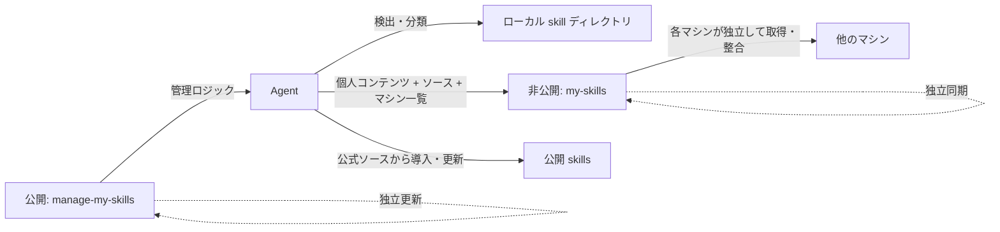

<div align="center">


# manage-my-skills

**個人 Agent skills のライフサイクル管理。**

再利用できる作業を非公開 skill にし、公開 skill は元のソースに紐付けたまま、両方をすべてのマシンで安全に整合させます。

[English](../README.md) | [简体中文](README.zh-CN.md) | [日本語](README.ja.md)

[](https://github.com/Pursuer-Hsf/manage-my-skills/actions/workflows/ci.yml)
[](../LICENSE)
[](https://www.python.org/)
[](https://agentskills.io/)

</div>

多くの skill ツールは、1 台のマシンに何かをインストールするところまでを支援します。どの Agent 知識が自分のものか、どう改善し、どのマシンに安全に存在させるかという難しい問いまでは解決しません。

`manage-my-skills` は 2 種類の skills に 1 つのライフサイクルを与えます。作業に長期的な価値が現れると個人 skill の作成・更新を提案し、個人の知識は非公開ライブラリに保存します。公開 skills はコピーせずソースを記録し、各マシンを同じ望ましい状態へ整合させます。

## 3 つの経路、1 つのインベントリ


| 起きること | マネージャーの処理 | 得られるもの |
| --- | --- | --- |
| タスクから再利用価値のある手順が生まれる | Agent がサニタイズ済みのプレビューを提案し、承認後にのみ非公開 skill を保存または更新 | 確認可能で継続的に改善できる個人知識 |
| マーケットプレイス、プラグイン、公開 skill を導入する | canonical source、パス、任意の ref だけを記録し、非公開ライブラリへコピーしない | 来歴、ライセンス境界、元の更新権限 |
| PC、ワークステーション、サーバーを追加する | 非公開コンテンツを同期し、公式ソースから公開 skills を整合 | パスを推測せず既存作業を上書きしない正しい状態 |

目的はすべての skill ディレクトリを複製することではありません。各マシンを同じ「必要な skills」の状態へ安全に到達させることです。GitHub が共通ハブであり、マシン同士の SSH 接続は必要ありません。

> **Agent が管理し、ユーザーが承認します。** 呼び出し時にマネージャーの更新を確認し、すべての変更を先にプレビューします。バックグラウンドで無断更新や push は行いません。

## インストール後に始まる問題

skill を 1 つ作る、またはインストールするのは簡単でも、増え続ける skills 全体の維持は簡単ではありません。

- 有用な手順が古いチャットやプロジェクトに埋もれ、再利用可能な skill として残らない。
- 後の作業で改善点が見つかっても、既存 skill が更新されない。
- ノート PC と複数サーバーのコピーが、気付かないうちに別バージョンになる。
- 公開 skills をマシンごとに探し直し、インストール・更新する必要がある。
- バックアップはリポジトリ、認証情報、パス、リンク、複数マシンにまたがる。
- 新しいマシンでは、何をどこにインストールしたかを思い出して再構築する必要がある。
- 公開ツール、サードパーティ skills、個人の非公開知識が混在しやすく、本来は異なる所有権と更新ルールが必要になる。

`manage-my-skills` は統一された skills インベントリを Agent に提供します。個人 skills は非公開コンテンツとして同期し、公開 skills はソース情報を同期して各マシンで公式ソースから導入・更新します。

## このリポジトリを Agent に渡すだけで開始

ファイルシステムと GitHub にアクセスできる Agent にリポジトリ URL を渡し、次のように依頼します。

> このリポジトリの `skills/manage-my-skills/SKILL.md` を読んでください。新規作成または更新すべき個人 skill を自動検出し、個人 skills は非公開で同期、公開 skills は元のソースから導入・更新して、すべてのマシンで一致させてください。変更は先にプレビューしてください。

Agent は環境確認、GitHub アクセス、非公開リポジトリの検証、機密情報のスキャン、インストール、同期、検証を担当します。GitHub の到達性をログイン前に確認し、到達できない場合はプロキシの利用またはネットワークアクセスの承認を案内します。

## インストーラーとは異なる層

[Vercel skills CLI](https://github.com/vercel-labs/skills) や [OpenSkills](https://github.com/numman-ali/openskills) は、skills の検出、読み込み、導入、更新を主に扱います。`manage-my-skills` はそれらと競合するのではなく、個人が実際に依存する skills の所有権、来歴、進化、マシン横断の状態を管理します。

| 問い | マーケットプレイス / インストーラー | `manage-my-skills` |
| --- | --- | --- |
| このマシンに公開 skill をどう追加するか | 検索して導入する | 導入後に canonical source を記録する |
| 良いタスクを再利用可能な知識にするには | 通常はインストーラーの範囲外 | 非公開 skill の作成・更新を提案し、確認可能なプレビューを出す |
| 非公開と公開 skills をどう共存させるか | ローカルファイルとソースのコピー | 非公開コンテンツは非公開のまま、公開 skills はソース管理 |
| 新しいマシンを安全に整えるには | 手動で再導入しパスを再構築する | 非公開 skills を復元し、ソース一覧を整合。上書きしない |
| Agent に保守を委任できるか | ツール依存 | 非公開リポジトリ検証、機密チェック、プレビュー、明示的承認 |
| skills に触れずマネージャーだけ更新できるか | 一般的な中心設計ではない | 公開マネージャーと非公開ライブラリを独立更新 |

## アーキテクチャ



公開リポジトリにはマネージャーを置きます。非公開リポジトリには個人 skills、移植可能な公開ソース一覧、任意の安全なマシン名を置きます。マシン固有パス、認証情報、接続詳細はローカルだけに保存します。各マシンは GitHub へ独立して接続するため、サーバー同士が接続できる必要はありません。この制御面の分離により、マネージャーは個人 skills を無断で変更せずに独立更新できます。

## 主な機能

- Codex、共有 Agent、一般的なローカル skill ディレクトリを検出。
- skills を personal、shared-local、managed、unknown に分類。
- 再利用価値を検出し、新しい個人 skill の作成または既存 skill の更新を提案。
- 最初のマシンで非公開ライブラリを作成し、追加マシンは GitHub 経由で独立して接続。
- 機密情報とディレクトリ外 symlink を確認してから、ユーザー所有 skill を 1 件ずつ import。
- 既存の個人 skill を管理対象にするときは、ローカルバックアップを保持してから管理リンクへ置換。
- 公開、マーケットプレイス、プラグイン skills のソース、パス、任意バージョンを記録。
- 各マシンで公式の方法を使ってソース管理 skills を導入・更新。
- 許可されたパスだけを、fast-forward-only の Git 動作で同期。
- 全ターゲットを事前確認し、上書きなしで symlink を復元。
- Git、GitHub 認証、ローカル状態、リポジトリ状態を診断。
- 呼び出し時に公開マネージャーを確認し、安全な fast-forward だけで更新。
- 1 つの非公開ソースを端末と複数サーバーで同期しつつ、各マシンは独自の ID、パス、認証を保持。

## 使い方

リポジトリのリンクを Agent に渡し、目的に合う一文を送ります。

### 初回設定

```text
このリポジトリを読んで manage-my-skills を設定してください。
個人 skills と公開 skills を確認し、非公開の管理リポジトリを作成してください。
このマシンを登録しますが、承認前に既存 skill を置換・import しないでください。
先にプレビューし、ログインや承認が必要なら知らせてください。
```

### 既存ライブラリを使う

```text
manage-my-skills を非公開 skills リポジトリ OWNER/my-skills に接続してください。
先に競合を確認し、既存 skills は上書きしないでください。
```

### 別のマシンを追加

```text
このマシンで manage-my-skills を設定し、OWNER/my-skills に参加させてください。
worker-a として登録し、個人 skills の復元と公開 skills の整合計画を先に見せてください。
このマシンは GitHub にしか接続できない可能性があります。他のマシンへの SSH を前提にしないでください。
```

### 日常メンテナンス

```text
すべての skills を確認して管理してください。
新規作成・更新すべき個人 skill と、公開 skills の導入・バージョン差異を報告してください。
manage-my-skills 自身の更新も確認してください。
承認後に変更してください。
```

### Agent から新規作成・更新を提案

再利用できる作業が完了すると、Agent が次のように提案します。

```text
Agent: この手順は既存の xxx skill を改善できます。更新しますか？
あなた: はい。先に匿名化した変更を見せてください。
```

対応する skill がなければ、新規作成を提案します。承認前に変更は行いません。

### 複数サーバーを同期

```text
server-a、server-b、server-c の skills を一致させてください。
非公開ライブラリを共通ハブにし、サーバー間の接続を前提にしないでください。
各マシンでマネージャー、ローカル登録、個人 link、公開ソースを確認してください。
各修復を先にプレビューし、上書きせず、各マシンのローカル結果をまとめてください。
```

### 新しいマシンで復元

```text
このマシンを OWNER/my-skills に参加させてから、管理対象 skills を復元してください。
個人 skills を復元し、公開 skills は記録されたソースから再導入・更新してください。
先に競合を確認し、既存の内容は上書きしないでください。
```

### マネージャーだけを更新

```text
manage-my-skills の更新を確認し、計画を先に表示してください。
承認後、マネージャーだけを更新してください。
非公開 skills ライブラリは変更・同期しないでください。
```

## 非公開リポジトリ形式

```text
my-skills/
├── library.json
├── fleet.json        # 任意: 安全なマシン ID、名前、役割
└── skills/
    └── your-skill/
        ├── SKILL.md
        ├── scripts/
        ├── references/
        └── assets/
```

`library.json` はソース管理 skills の移植可能な一覧を保持し、識別子、パス、任意の ref だけを記録します。実行可能なインストールコマンドは保存しません。任意の `fleet.json` にはランダムなマシン ID、安全な名前、役割、有効状態だけを保存し、ホスト名、IP、SSH alias、パス、認証情報は保存しません。

ローカル接続状態の既定パス：

```text
~/.config/manage-my-skills/state.json
```

ここにはリポジトリ識別子、ローカルパス、schema バージョン、タイムスタンプ、ローカルのランダム ID と安全な名前だけを保存し、認証情報は保存しません。

## セキュリティモデル

- 変更は事前にプレビューし、明示的な承認を得ます。
- skills リポジトリが Private であることを検証します。
- 既存のローカル checkout は、検証済みのリポジトリを指している必要があります。
- 認証情報は GitHub または OS の認証情報ストアに保存します。
- 機密情報らしい内容、危険なリンク、競合、既存ターゲットがある場合は停止します。
- 上書き、force push、自動 merge は行いません。
- 公開マネージャーは fast-forward だけで更新し、ローカル変更や履歴分岐があれば停止します。
- 公開、マーケットプレイス、プラグイン、組み込み skills は元の更新権限を維持し、移植可能なソース情報だけを同期します。
- マシン一覧には接続詳細を保存しません。別の報告経路が設定されない限り、ローカル確認で分かるのは現在のマシンだけです。

自動検査だけで安全性を証明することはできません。詳細は [SECURITY.md](../SECURITY.md) を参照してください。

## 互換性とスコープ

`manage-my-skills` は公開 [`SKILL.md` 形式](https://agentskills.io/) を使用し、Codex を優先してサポートします。ファイルシステムへアクセスできる他の Agent でも、Python 3.9+、Git、GitHub アクセスがあれば使用できます。各マシンには自身の GitHub アクセスが必要で、SSH は同期の必須条件ではありません。検出パスや自動動作は Agent ごとに異なる場合があります。

## トラブルシューティング

```text
manage-my-skills を診断し、変更前に原因と修復案を報告してください。
```

## 開発

```bash
python3 -m unittest discover -s tests -v
```

実行時にサードパーティ製 Python パッケージは必要ありません。

## コントリビューション

Issue と範囲を絞った pull request を歓迎します。開発ガイドは [AGENTS.md](../AGENTS.md) を参照してください。

## ライセンス

[MIT](../LICENSE)
