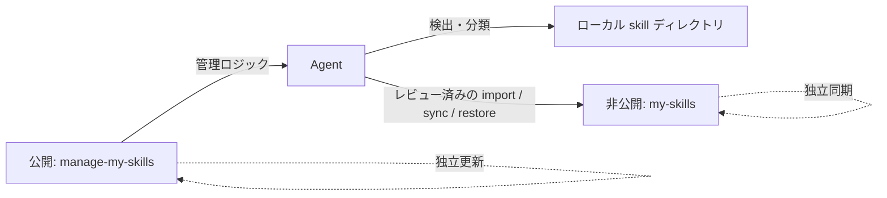

<div align="center">

# manage-my-skills

**増え続ける個人 skills を Agent に任せて整理、蓄積、複数サーバーで同期。**

1 つの非公開 skills ライブラリを、すべての端末とサーバーへ。日常管理は Agent との会話で進みます。

[English](../README.md) | [简体中文](README.zh-CN.md) | [日本語](README.ja.md)

[](https://github.com/Pursuer-Hsf/manage-my-skills/actions/workflows/ci.yml)
[](../LICENSE)
[](https://www.python.org/)
[](https://agentskills.io/)

</div>

本当の難しさは skill を書くことではなく、チャット、プロジェクト、複数サーバーに散らばった skills を長期的に育て続けることです。

`manage-my-skills` は、散在する個人 skills を継続的に成長する**非公開の個人能力ライブラリ**へ変えます。Agent が検出、分類、GitHub 設定、安全なバックアップ、復元、複数サーバー同期を担当します。ユーザーが目的を伝え、Agent がマネージャーを操作します。

## 個人 skills 管理の悩み

skill を 1 つ作るのは簡単でも、増え続ける個人ライブラリの維持は簡単ではありません。

- 有用な手順が古いチャットやプロジェクトに埋もれ、再利用可能な skill として残らない。
- ノート PC と複数サーバーのコピーが、気付かないうちに別バージョンになる。
- バックアップはリポジトリ、認証情報、パス、リンク、複数マシンにまたがる。
- 新しいマシンでは、何をどこにインストールしたかを思い出して再構築する必要がある。
- 公開ツール、サードパーティ skills、個人の非公開知識が混在しやすい。

`manage-my-skills` は非公開の単一ソースを用意し、現状把握、所有物の判定、知識の蓄積、別マシンへのインストール、変更報告という反復作業を Agent に任せます。

> **Agent が管理し、ユーザーが承認します。** Agent は依頼されたときに動作し、変更を先にプレビューします。認証、競合、破壊的な判断、機密情報が関わる場合は停止して確認します。バックグラウンドで無断 push は行いません。

## このリポジトリを Agent に渡すだけで開始

ファイルシステムと GitHub にアクセスできる Agent にリポジトリ URL を渡し、次のように依頼します。

> このリポジトリの `skills/manage-my-skills/SKILL.md` を読んでください。ローカル skills をスキャンし、再利用可能な個人ワークフローを蓄積して、別の非公開 GitHub リポジトリを通じて端末と複数サーバーのユーザー所有 skills を同期してください。変更は必ず先にプレビューし、ブラウザログイン、MFA、承認が必要になったら知らせてください。

Agent は環境確認、GitHub アクセス、非公開リポジトリの検証、機密情報のスキャン、インストール、同期、検証を担当し、認証や承認が必要な場合は明確に知らせます。

## このプロジェクトの役割

[Vercel skills CLI](https://github.com/vercel-labs/skills) や [OpenSkills](https://github.com/numman-ali/openskills) は、主に公開・共有 skills の検索とインストールを扱います。[Anthropic Skills](https://github.com/anthropics/skills) や [Awesome Agent Skills](https://github.com/VoltAgent/awesome-agent-skills) は再利用可能な skill コレクションです。`manage-my-skills` はそれらを補完し、非公開のユーザー所有 skills を管理します。

| 観点 | マーケットプレイス / インストーラー | `manage-my-skills` |
| --- | --- | --- |
| サードパーティ skills の検索 | 主用途 | 分類し、参照元を記録 |
| チャットやプロジェクトに埋もれた個人手順 | 通常は対象外 | 検出し、長期利用できる skills として蓄積 |
| 個人 skills の非公開バックアップ | 通常は外部フロー | 中核機能 |
| 端末と複数サーバーのバージョンずれ | 各ターゲットを個別に再導入・更新 | 1 つの非公開ソースからマシンごとに安全に復元 |
| GitHub 初心者向け導入 | ツールごとに異なる | Agent が案内 |
| Private 設定の確認 | 常に必要とは限らない | コピー・push 前に必須 |
| 変更前プレビュー | ツール依存 | デフォルト |
| マネージャーと skills の独立更新 | 一般的な中心設計ではない | 中核アーキテクチャ |
| Git 競合の自動解決 | ツール依存 | 意図的に拒否 |

## アーキテクチャ



公開リポジトリには汎用コード、ドキュメント、テスト、匿名化された例だけを置きます。非公開リポジトリにはユーザー所有 skills を置きます。マシン固有パスはローカル状態ファイルに保存し、GitHub 認証情報は GitHub CLI または OS の認証情報ストアに任せます。

## 主な機能

- Codex、共有 Agent、一般的なローカル skill ディレクトリを検出。
- skills を personal、shared-local、managed、unknown に分類。
- 散在する再利用可能な手順を、継続的に育つ非公開 skills ライブラリへ蓄積。
- 新しい非公開 GitHub skill ライブラリの作成、または既存ライブラリへの接続。
- 機密情報とディレクトリ外 symlink を確認してから、ユーザー所有 skill を 1 件ずつ import。
- 許可されたパスだけを、fast-forward-only の Git 動作で同期。
- 全ターゲットを事前確認し、上書きなしで symlink を復元。
- Git、GitHub 認証、ローカル状態、リポジトリ状態を診断。
- 非公開 skills に触れず、公開マネージャーだけを更新。
- 1 つの非公開ソースを端末と複数サーバーで同期しつつ、各マシンは独自の状態と認証を保持。

## 使い方

リポジトリのリンクを Agent に渡し、目的に合う一文を送ります。

### 初回設定

```text
このリポジトリを読んで manage-my-skills を設定してください。
ローカル skills をスキャンし、個人 skills 用の非公開リポジトリを作成してください。
先にプレビューし、ログインや承認が必要なら知らせてください。
```

### 既存ライブラリを使う

```text
manage-my-skills を非公開 skills リポジトリ OWNER/my-skills に接続してください。
先に競合を確認し、既存 skills は上書きしないでください。
```

### 日常メンテナンス

```text
個人 skills ライブラリを確認して管理してください。
先に問題を報告し、承認後にバックアップと同期を行ってください。
```

### Agent から skill 化を提案

再利用できる作業が完了すると、Agent が次のように提案します。

```text
Agent: この手順は再利用できます。個人 skill として保存しますか？
あなた: はい。先に匿名化した内容を見せてください。
```

承認後にのみ、Agent が作成、非公開ライブラリへの追加、同期を行います。

### 複数サーバーを同期

```text
server-a、server-b、server-c を同じ非公開 skills ライブラリへ接続してください。
1 台ずつ確認し、上書きせず、最後に結果をまとめてください。
```

### 新しいマシンで復元

```text
OWNER/my-skills からこのマシンへ個人 skills を復元してください。
先に競合を確認し、既存の内容は上書きしないでください。
```

### マネージャーだけを更新

```text
manage-my-skills だけを更新してください。
非公開 skills ライブラリは変更・同期しないでください。
```

## 非公開リポジトリ形式

```text
my-skills/
├── library.json
└── skills/
    └── your-skill/
        ├── SKILL.md
        ├── scripts/
        ├── references/
        └── assets/
```

ローカル接続状態の既定パス：

```text
~/.config/manage-my-skills/state.json
```

ここにはリポジトリ識別子、ローカルパス、schema バージョン、タイムスタンプだけを保存し、認証情報は保存しません。

## セキュリティモデル

- 変更は事前にプレビューし、明示的な承認を得ます。
- skills リポジトリが Private であることを検証します。
- 認証情報は GitHub または OS の認証情報ストアに保存します。
- 機密情報らしい内容、危険なリンク、競合、既存ターゲットがある場合は停止します。
- 上書き、force push、自動 merge は行いません。
- サードパーティ、マーケットプレイス、プラグイン、組み込み skills は、既定ではコピーせず参照元だけを記録します。

自動検査だけで安全性を証明することはできません。詳細は [SECURITY.md](../SECURITY.md) を参照してください。

## 互換性とスコープ

`manage-my-skills` は公開 [`SKILL.md` 形式](https://agentskills.io/) を使用し、Codex を優先してサポートします。ファイルシステムへアクセスできる他の Agent でも、Python 3.9+、Git、GitHub アクセスがあれば使用できます。検出パスや自動動作は Agent ごとに異なる場合があります。

## トラブルシューティング

```text
manage-my-skills を診断し、変更前に原因と修復案を報告してください。
```

## 開発

```bash
python3 -m unittest discover -s tests -v
```

実行時にサードパーティ製 Python パッケージは必要ありません。

## コントリビューション

Issue と範囲を絞った pull request を歓迎します。開発ガイドは [AGENTS.md](../AGENTS.md) を参照してください。

## ライセンス

[MIT](../LICENSE)
