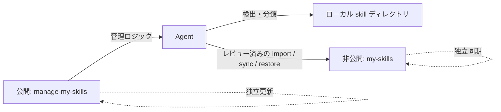

<div align="center">

# manage-my-skills

**増え続ける個人 skills を Agent に任せて整理、蓄積、複数サーバーで同期。**

1 つの非公開 skills ライブラリを、すべての端末とサーバーへ。日常の Git 操作はほぼ不要です。

[English](../README.md) | [简体中文](README.zh-CN.md) | [日本語](README.ja.md)

[](https://github.com/Pursuer-Hsf/manage-my-skills/actions/workflows/ci.yml)
[](../LICENSE)
[](https://www.python.org/)
[](https://agentskills.io/)

</div>

本当の難しさは skill を書くことではなく、チャット、プロジェクト、複数サーバーに散らばった skills を長期的に育て続けることです。

`manage-my-skills` は、散在する個人 skills を継続的に成長する**非公開の個人能力ライブラリ**へ変えます。Agent が検出、分類、GitHub 設定、安全なバックアップ、復元、複数サーバー同期を担当し、ユーザーは価値ある知識に集中できます。

## 個人 skills 管理の悩み

skill を 1 つ作るのは簡単でも、増え続ける個人ライブラリの維持は簡単ではありません。

- 有用な手順が古いチャットやプロジェクトに埋もれ、再利用可能な skill として残らない。
- ノート PC と複数サーバーのコピーが、気付かないうちに別バージョンになる。
- バックアップには Git、リポジトリ、認証情報、パス、リンクの知識が必要。
- 新しいマシンでは、何をどこにインストールしたかを思い出して再構築する必要がある。
- 公開ツール、サードパーティ skills、個人の非公開知識が混在しやすい。

`manage-my-skills` は非公開の単一ソースを用意し、現状把握、所有物の判定、知識の蓄積、別マシンへのインストール、変更報告という反復作業を Agent に任せます。

> **低負担ですが、無人運転ではありません。** 日常的な Git とディレクトリ操作をユーザーが行わなくてよい、という意味です。Agent は呼び出されたときに動作し、変更を先にプレビューして、認証や競合など重要な場面だけ確認を求めます。バックグラウンドで無断 push は行いません。

## このリポジトリを Agent に渡すだけで開始

Git コマンドを覚える必要はありません。ファイルシステムと GitHub にアクセスできる Agent にリポジトリ URL を渡し、次のように依頼します。

> このリポジトリの `skills/manage-my-skills/SKILL.md` を読んでください。ローカル skills をスキャンし、再利用可能な個人ワークフローを蓄積して、別の非公開 GitHub リポジトリを通じて端末と複数サーバーのユーザー所有 skills を同期してください。変更は必ず先にプレビューし、ブラウザログイン、MFA、承認が必要になったら知らせてください。

Agent は環境確認、GitHub CLI の設定、非公開リポジトリの検証、機密情報のスキャン、インストール、同期、検証を担当します。ユーザーが行うのは、明示された変更の承認とブラウザでの GitHub 認証だけです。

## このプロジェクトの役割

[Vercel skills CLI](https://github.com/vercel-labs/skills) や [OpenSkills](https://github.com/numman-ali/openskills) は、主に公開・共有 skills の検索とインストールを扱います。[Anthropic Skills](https://github.com/anthropics/skills) や [Awesome Agent Skills](https://github.com/VoltAgent/awesome-agent-skills) は再利用可能な skill コレクションです。`manage-my-skills` はそれらを補完し、非公開のユーザー所有 skills を管理します。

| 観点 | マーケットプレイス / インストーラー | `manage-my-skills` |
| --- | --- | --- |
| サードパーティ skills の検索 | 主用途 | 分類し、参照元を記録 |
| チャットやプロジェクトに埋もれた個人手順 | 通常は対象外 | 検出し、長期利用できる skills として蓄積 |
| 個人 skills の非公開バックアップ | 通常は外部フロー | 中核機能 |
| 端末と複数サーバーのバージョンずれ | 各ターゲットを個別に再導入・更新 | 1 つの非公開ソースからマシンごとに安全に復元 |
| GitHub 初心者向け導入 | ツールごとに異なる | Agent が案内 |
| Private 設定の確認 | 常に必要とは限らない | コピー・push 前に必須 |
| 変更前プレビュー | ツール依存 | デフォルト |
| マネージャーと skills の独立更新 | 一般的な中心設計ではない | 中核アーキテクチャ |
| Git 競合の自動解決 | ツール依存 | 意図的に拒否 |

## アーキテクチャ



公開リポジトリには汎用コード、ドキュメント、テスト、匿名化された例だけを置きます。非公開リポジトリにはユーザー所有 skills を置きます。マシン固有パスはローカル状態ファイルに保存し、GitHub 認証情報は GitHub CLI または OS の認証情報ストアに任せます。

## 主な機能

- Codex、共有 Agent、一般的なローカル skill ディレクトリを検出。
- skills を personal、shared-local、managed、unknown に分類。
- 散在する再利用可能な手順を、継続的に育つ非公開 skills ライブラリへ蓄積。
- 新しい非公開 GitHub skill ライブラリの作成、または既存ライブラリへの接続。
- 機密情報とディレクトリ外 symlink を確認してから、ユーザー所有 skill を 1 件ずつ import。
- 許可されたパスだけを、fast-forward-only の Git 動作で同期。
- 全ターゲットを事前確認し、上書きなしで symlink を復元。
- Git、GitHub 認証、ローカル状態、リポジトリ状態を診断。
- 非公開 skills に触れず、公開マネージャーだけを更新。
- 1 つの非公開ソースを端末と複数サーバーで同期しつつ、各マシンは独自の状態と認証を保持。

## クイックスタート

### 1. Codex にインストール

```bash
git clone https://github.com/Pursuer-Hsf/manage-my-skills.git \
  ~/.local/share/manage-my-skills
mkdir -p ~/.codex/skills
ln -s ~/.local/share/manage-my-skills/skills/manage-my-skills \
  ~/.codex/skills/manage-my-skills
```

Codex を再起動または再読み込みし、`$manage-my-skills` を明示的に呼び出します。この skill は暗黙呼び出しを有効にしません。

### 2. Agent に非公開ライブラリを設定させる

```text
$manage-my-skills を使ってローカル skills をスキャンし、
非公開 GitHub バックアップを設定してください。
すべての変更を先にプレビューし、適用前に確認してください。
```

### 3. 結果を確認

Agent は `doctor`、`status`、restore のプレビューを実行します。正常な状態では、GitHub 認証済み、Git リポジトリ接続済み、予期しない変更なし、各管理対象 skill のリンクが正しい、または作成予定として明示されます。

## 手動 CLI

この skill は Agent 向けですが、すべての操作を Python 標準ライブラリだけで動く CLI から実行できます。

```bash
MANAGER="$HOME/.codex/skills/manage-my-skills/scripts/manage_my_skills.py"

python3 "$MANAGER" doctor
python3 "$MANAGER" scan
python3 "$MANAGER" status
```

| コマンド | 目的 | デフォルトで変更するか |
| --- | --- | --- |
| `doctor` | Git、GitHub ログイン、状態、ライブラリを確認 | いいえ |
| `scan` | ローカル skills を検出・分類 | いいえ |
| `setup` | 検証済み非公開ライブラリを作成・clone | いいえ。`--apply` が必要 |
| `connect` | 既存 checkout を変更せず接続 | いいえ。`--apply` が必要 |
| `import` | レビュー済みの所有 skill をライブラリへコピー | いいえ。`--apply` が必要 |
| `status` | バックアップとワークツリー変更を表示 | いいえ |
| `sync` | fetch、許可済み内容の commit、安全な push | いいえ。`--apply` が必要 |
| `restore` | 事前確認し、不足する skill リンクを作成 | いいえ。`--apply` が必要 |
| `update-manager` | 公開マネージャーだけを fast-forward | いいえ。`--apply` が必要 |

完全な引数は `python3 "$MANAGER" <command> --help` で確認できます。

## よく使うワークフロー

### 新しい非公開ライブラリを作成

```bash
python3 "$MANAGER" setup \
  --repo YOUR_GITHUB_USER/my-skills \
  --library-dir ~/.local/share/my-skills

# プレビュー確認後に適用
python3 "$MANAGER" setup \
  --repo YOUR_GITHUB_USER/my-skills \
  --library-dir ~/.local/share/my-skills \
  --apply
```

### 既存の非公開ライブラリへ接続

```bash
python3 "$MANAGER" connect \
  --repo YOUR_GITHUB_USER/my-skills \
  --library-dir ~/.local/share/my-skills

python3 "$MANAGER" connect \
  --repo YOUR_GITHUB_USER/my-skills \
  --library-dir ~/.local/share/my-skills \
  --apply
```

`connect` は GitHub 上の Private 設定を検証し、ローカル状態だけを記録します。リポジトリの初期化、commit、push は行いません。

### 個人 skill を import して同期

```bash
python3 "$MANAGER" import ~/path/to/my-skill
python3 "$MANAGER" import ~/path/to/my-skill --apply

python3 "$MANAGER" sync
python3 "$MANAGER" sync --message "Update my skill" --apply
```

import と sync は意図的に分離されています。import が自動的に push することはありません。

### 別マシンで復元

```bash
python3 "$MANAGER" restore \
  --repo YOUR_GITHUB_USER/my-skills \
  --library-dir ~/.local/share/my-skills \
  --target ~/.codex/skills

# 競合がないことを確認してから適用
python3 "$MANAGER" restore \
  --repo YOUR_GITHUB_USER/my-skills \
  --library-dir ~/.local/share/my-skills \
  --target ~/.codex/skills \
  --apply
```

## 非公開リポジトリ形式

```text
my-skills/
├── library.json
└── skills/
    └── your-skill/
        ├── SKILL.md
        ├── scripts/
        ├── references/
        └── assets/
```

ローカル接続状態の既定パス：

```text
~/.config/manage-my-skills/state.json
```

ここにはリポジトリ識別子、ローカルパス、schema バージョン、タイムスタンプだけを保存し、認証情報は保存しません。

非公開 skills をこの公開リポジトリに置き、`.gitignore` で隠してはいけません。無視されたファイルはマシン間で同期されず、`git clean -xfd` などで削除される可能性があります。

## セキュリティモデル

- デフォルトはプレビュー。変更には明示的な `--apply` が必要。
- setup、import、sync、restore の前に GitHub がリポジトリを Private と報告する必要があります。
- 認証は `gh` または OS の認証情報ストアが管理します。
- import は認証情報らしい内容と、skill 外へ出る symlink を拒否します。
- sync が stage するのは `library.json` と `skills/` だけで、`git add -A` は使いません。
- pull とマネージャー更新は fast-forward-only です。
- restore はリンク作成前に全ターゲットを検査します。
- 既存ターゲット、分岐した履歴、競合、force push、自動 merge が必要な場合は停止します。
- サードパーティ、マーケットプレイス、プラグイン、組み込み skills は、既定ではコピーせず参照元だけを記録します。

パターン検出だけで安全性を証明することはできません。アップロード前に内部ホスト、個人識別情報、独自手順、ライセンス、機密情報を確認してください。詳細は [SECURITY.md](../SECURITY.md) を参照してください。

## 互換性とスコープ

`manage-my-skills` は公開 [`SKILL.md` 形式](https://agentskills.io/) を使用し、自動検出・インストールは Codex を第一対象とします。他の Agent でも、次の条件を満たせば `skills/manage-my-skills/SKILL.md` を読み、CLI を実行できます。

- ファイルシステムへのアクセス
- Python 3.9 以降
- Git
- 非公開リポジトリ検証用 GitHub CLI
- ネットワークと GitHub 権限

自動呼び出し、skill 検索パス、hooks、symlink 対応は Agent ごとに異なります。すべてのプラットフォームで同一の自動動作を保証するものではありません。

## トラブルシューティング

最初に次を実行します。

```bash
python3 "$MANAGER" doctor
```

- `github-login`: `gh auth login -h github.com` を実行し、ブラウザまたはデバイスフローを承認します。
- `library`: checkout が存在し、`.git/` と `skills/` を含むことを確認します。
- restore ターゲットが既存: 手動で確認してください。マネージャーは置き換えません。
- Git 履歴が分岐: バックアップ後、マネージャー外で手動解決します。
- skill が見えない: symlink を確認し、Agent プロセスを再起動または再読み込みします。

## 開発

```bash
python3 -m unittest discover -s tests -v
python3 -m py_compile skills/manage-my-skills/scripts/manage_my_skills.py
python3 ~/.codex/skills/.system/skill-creator/scripts/quick_validate.py \
  skills/manage-my-skills
```

実行時の Python パッケージ依存はありません。外部 skill バリデーターには開発時に `PyYAML` が必要な場合があります。

## 設計上の参考

README の構成とエコシステム用語は、次の成熟したプロジェクトを参考にしています。

- [obra/superpowers](https://github.com/obra/superpowers): Agent ファーストの導入とプラットフォーム別インストール
- [anthropics/skills](https://github.com/anthropics/skills)、[agentskills/agentskills](https://github.com/agentskills/agentskills): skill 構造と progressive disclosure
- [vercel-labs/skills](https://github.com/vercel-labs/skills)、[numman-ali/openskills](https://github.com/numman-ali/openskills): CLI ナビゲーション、source/target の区別、symlink インストール
- [VoltAgent/awesome-agent-skills](https://github.com/VoltAgent/awesome-agent-skills): サードパーティ skill の明確なセキュリティ注意

`manage-my-skills` は独立したプロジェクトであり、これらのプロジェクトのコードを含みません。

## コントリビューション

Issue と範囲を絞った pull request を歓迎します。安全動作を変更する前に [AGENTS.md](../AGENTS.md) を読んでください。変更は、プレビュー優先、Private 検証、stage パスの allowlist、上書きしない restore を維持する必要があります。

## ライセンス

[MIT](../LICENSE)
