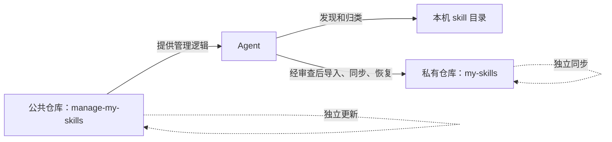

<div align="center">

# manage-my-skills

**个人 skills 越积越多、机器越用越乱？交给 Agent 自动归档、私密沉淀、多服务器同步。**

一个私有 skills 库，覆盖本机和所有服务器；日常管理只需要告诉 Agent 你想做什么。

[English](../README.md) | [简体中文](README.zh-CN.md) | [日本語](README.ja.md)

[](https://github.com/Pursuer-Hsf/manage-my-skills/actions/workflows/ci.yml)
[](../LICENSE)
[](https://www.python.org/)
[](https://agentskills.io/)

</div>

真正的难点通常不是“不会写 skill”，而是写完之后散落在聊天、项目目录和不同服务器里，时间一久就找不到、不同步、不敢改。

`manage-my-skills` 把这些零散经验沉淀成一个持续成长的**个人私有能力库**。把项目交给 Agent，它负责发现、归类、GitHub 配置、安全备份、恢复和多服务器同步；你描述目标，Agent 操作管理器。

## 它解决的就是这些麻烦

创建一个 skill 不难，长期维护越来越多的个人 skills 才麻烦：

- 好用的流程留在旧聊天和项目目录里，没有真正沉淀成可复用能力。
- 笔记本和多台服务器各有一份，时间一久版本悄悄漂移。
- 备份同时涉及仓库、凭据、目录、链接和多台机器。
- 换机器或新增服务器时，要重新回忆装过什么、路径在哪里。
- 公共工具、第三方 skills 和自己的私有经验容易混在一起，更新时互相影响。

`manage-my-skills` 提供一个私有的唯一事实来源，让 Agent 承担重复劳动：盘点现状、判断哪些属于你、持续沉淀、跨机器安装，并清楚报告每次变化。

> **Agent 管理，用户确认。** Agent 在收到请求时工作，所有修改先预览；遇到登录、冲突、破坏性决策或敏感内容时必须停下来确认。它不会在后台静默推送。

## 把仓库交给 Agent 即可开始

把本仓库 URL 发给能够访问本机文件和 GitHub 的 Agent，然后告诉它：

> 阅读本仓库中的 `skills/manage-my-skills/SKILL.md`。扫描我的本地 skills，识别并沉淀可复用的个人流程，通过一个独立的私有 GitHub 仓库，让我的自有 skills 在本机和多台服务器之间保持一致。所有修改必须先预览；需要浏览器登录、MFA 或授权时及时告诉我。

Agent 应负责环境检查、GitHub 访问、私库验证、敏感内容扫描、安装、同步和验证，并在需要身份验证或批准时清楚说明。

## 为什么需要这个项目

[Vercel skills CLI](https://github.com/vercel-labs/skills) 和 [OpenSkills](https://github.com/numman-ali/openskills) 等项目主要解决公共或共享 skills 的发现与安装；[Anthropic Skills](https://github.com/anthropics/skills) 和 [Awesome Agent Skills](https://github.com/VoltAgent/awesome-agent-skills) 提供可复用的 skill 集合。`manage-my-skills` 与它们互补，专门管理私有、用户自有的部分。

| 关注点 | 市场或安装器 | `manage-my-skills` |
| --- | --- | --- |
| 发现第三方 skills | 核心用途 | 归类并记录来源 |
| 个人经验散落在聊天和项目目录 | 通常不负责 | 发现并沉淀成长期可复用 skills |
| 私密备份个人 skills | 通常由外部流程负责 | 核心工作流 |
| 本机和多台服务器版本漂移 | 每台机器分别重装或更新 | 一个私有事实来源，按机器安全恢复 |
| 面向 GitHub 新手的引导 | 各项目不同 | 由 Agent 分步完成 |
| 验证仓库确实为 Private | 不一定需要 | 复制或推送前强制验证 |
| 修改前预览 | 取决于工具 | 默认行为 |
| 管理器与 skills 独立更新 | 通常不是核心模型 | 核心架构 |
| 自动解决 Git 冲突 | 取决于工具 | 明确拒绝 |

## 架构



公共仓库只包含通用代码、文档、测试和脱敏示例。私有仓库存放用户自有 skills。机器相关路径写入本机状态文件。GitHub 凭据由 GitHub CLI 或操作系统凭据管理器保存。

## 主要能力

- 扫描 Codex、共享 Agent 和常见本地 skill 目录。
- 将 skills 初步归类为个人、共享本地、受管理和未知来源。
- 把散落的可复用流程持续沉淀成私有个人 skills 库。
- 创建新的私有 GitHub skill 库，或连接已有私库。
- 经过敏感内容与越界符号链接检查后导入单个自有 skill。
- 只同步白名单路径，并使用 fast-forward-only Git 行为。
- 先完整检查所有目标，再用规范符号链接恢复 skills，绝不覆盖。
- 诊断 Git、GitHub 登录、本机状态和仓库健康状况。
- 只更新公共管理器，不触碰私有 skills。
- 以一个私库作为唯一事实来源，同步本机和多台服务器；每台机器仍独立保存状态和 GitHub 身份验证。

## 如何使用

把仓库链接发给 Agent，再按需要发送下面一句话。

### 第一次配置

```text
阅读这个仓库并配置 manage-my-skills。
扫描本机 skills，为我的个人 skills 创建私有仓库。
先预览，需要登录或确认时告诉我。
```

### 使用已有私库

```text
使用 manage-my-skills 接管我的私有 skills 仓库 用户名/my-skills。
先检查冲突，不要覆盖已有 skills。
```

### 日常维护

```text
检查并维护我的个人 skills 库。
先报告问题，我确认后再备份和同步。
```

### 沉淀新 skill

```text
把这次任务中可复用的流程做成个人 skill。
先展示脱敏后的内容，我确认后再加入私库并同步。
```

### 同步多台服务器

```text
把 server-a、server-b、server-c 接入同一个私有 skills 库。
逐台检查，不要覆盖，完成后汇总结果。
```

### 在新机器恢复

```text
从 用户名/my-skills 恢复个人 skills 到这台机器。
先检查冲突，不要覆盖已有内容。
```

### 只更新管理器

```text
只更新 manage-my-skills。
不要修改或同步我的私有 skills 库。
```

## 私有仓库格式

```text
my-skills/
├── library.json
└── skills/
    └── your-skill/
        ├── SKILL.md
        ├── scripts/
        ├── references/
        └── assets/
```

本机连接状态默认保存在：

```text
~/.config/manage-my-skills/state.json
```

其中只能包含仓库标识、本机路径、schema 版本和时间戳，不能包含凭据。

不要把私人 skills 放进本公共仓库后再用 `.gitignore` 隐藏。被忽略的文件不会跨机器同步，还可能被 `git clean -xfd` 等命令删除。

## 安全模型

- 每项修改都必须先预览，并获得用户明确批准。
- 执行 setup、import、sync 或 restore 前，GitHub 必须报告技能仓库为 Private。
- 身份验证由 `gh` 或操作系统凭据管理器负责。
- 导入会拒绝疑似凭据内容和指向 skill 目录外的符号链接。
- 同步只暂存 `library.json` 和 `skills/`，绝不执行 `git add -A`。
- 拉取和管理器更新仅允许 fast-forward。
- restore 在创建任何链接前检查全部目标。
- 目标已存在、Git 历史分叉、冲突、force push 或自动合并需求都会让流程停止。
- 第三方、市场、插件和系统内置 skills 默认只记录来源，不复制到私库。

模式匹配无法证明内容绝对安全。上传前仍需审查内部主机、个人身份信息、专有流程、许可证和机密数据。完整策略见 [SECURITY.md](../SECURITY.md)。

## 兼容性与范围

`manage-my-skills` 使用开放的 [`SKILL.md` 格式](https://agentskills.io/)，自动发现和安装以 Codex 为首要支持目标。其他 Agent 在具备以下条件时，也可以读取 `skills/manage-my-skills/SKILL.md` 并操作内置管理器：

- 文件系统访问权限；
- Python 3.9 或更高版本；
- Git；
- 用于验证私库的 GitHub CLI；
- 网络和 GitHub 权限。

不同 Agent 的自动调用、skill 搜索路径、hooks 和符号链接支持并不相同。本项目不会宣称在所有平台上拥有完全一致的自动行为。

## 故障诊断

告诉 Agent：

> 诊断我的 `manage-my-skills`。检查身份验证、本机状态、仓库隐私属性、链接和同步状态。先报告原因和修复方案，不要直接修改。

常见处理：

- GitHub 身份验证：让 Agent 发起浏览器或设备登录，并在收到提示后完成批准。
- `library`：确认配置的 checkout 仍存在，并包含 `.git/` 和 `skills/`。
- restore 目标已存在：人工检查目标；管理器不会替换它。
- Git 历史分叉：先备份，再在管理器之外人工解决。
- Agent 看不到 skill：检查符号链接，并重启或重新载入 Agent 进程。

## 开发

```bash
python3 -m unittest discover -s tests -v
python3 -m py_compile skills/manage-my-skills/scripts/manage_my_skills.py
python3 ~/.codex/skills/.system/skill-creator/scripts/quick_validate.py \
  skills/manage-my-skills
```

运行时不依赖第三方 Python 包。外部 skill 校验器在开发验证时可能需要 `PyYAML`。

## 设计参考

README 的信息架构和生态术语参考了以下成熟项目：

- [obra/superpowers](https://github.com/obra/superpowers)：Agent-first 入门和分平台安装说明；
- [anthropics/skills](https://github.com/anthropics/skills) 与 [agentskills/agentskills](https://github.com/agentskills/agentskills)：skill 结构和渐进式披露术语；
- [vercel-labs/skills](https://github.com/vercel-labs/skills) 与 [numman-ali/openskills](https://github.com/numman-ali/openskills)：CLI 导航、来源/目标区分和符号链接安装；
- [VoltAgent/awesome-agent-skills](https://github.com/VoltAgent/awesome-agent-skills)：明确说明第三方 skill 的安全风险。

`manage-my-skills` 是独立项目，不包含这些项目的代码。

## 贡献

欢迎提交 issue 和范围明确的 pull request。修改安全行为前请阅读 [AGENTS.md](../AGENTS.md)。所有改动必须保留默认预览、私库验证、暂存路径白名单和 restore 不覆盖原则。

## 许可证

[MIT](../LICENSE)
