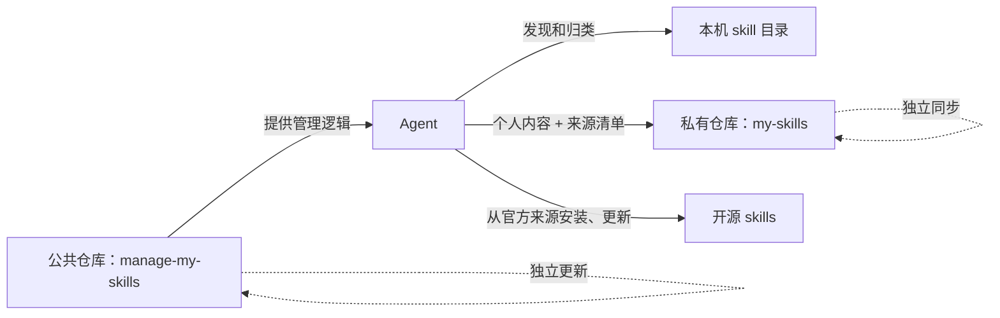

<div align="center">


# manage-my-skills

**让 Agent 把有价值的工作沉淀为可审查的私有 skills，并在所有机器上持续可用。**

Agent 识别可复用流程，你确认一次；个人 skills 保持私密，开源 skills 保留原始来源，所有机器保持一致，管理器也会检查自身更新。

[English](../README.md) | [简体中文](README.zh-CN.md) | [日本語](README.ja.md)

[](https://github.com/Pursuer-Hsf/manage-my-skills/actions/workflows/ci.yml)
[](../LICENSE)
[](https://www.python.org/)
[](https://agentskills.io/)

</div>

真正的难点不是写一个 skill，而是持续发现值得沉淀或更新的经验，并让所有机器上的 skills 保持一致。

`manage-my-skills` 让 Agent 自动识别可复用流程，主动建议新建或更新个人 skill，统一管理多台机器上的个人 skills 与开源 skills，并及时检查管理器自身更新。

## 它解决的就是这些麻烦

创建一个 skill 不难，长期维护越来越多的 skills 才麻烦：

- 好用的流程留在旧聊天和项目目录里，没有真正沉淀成可复用能力。
- 后续任务发现了更好的做法，却没有及时更新已有 skill。
- 笔记本和多台服务器各有一份，时间一久版本悄悄漂移。
- 开源 skills 需要在每台机器重复查找、安装和更新。
- 备份同时涉及仓库、凭据、目录、链接和多台机器。
- 换机器或新增服务器时，要重新回忆装过什么、路径在哪里。
- 公共工具、第三方 skills 和自己的私有经验容易混在一起，更新时互相影响。

`manage-my-skills` 为 Agent 提供一份统一的 skills 清单：个人 skills 以私密内容同步；开源 skills 同步来源信息，并在每台机器按官方来源安装或更新。

> **Agent 管理，用户确认。** 每次调用时，Agent 会检查管理器仓库更新，并预览所有修改。它不会在后台静默更新或推送。

## 把仓库交给 Agent 即可开始

把本仓库 URL 发给能够访问本机文件和 GitHub 的 Agent，然后告诉它：

> 阅读本仓库中的 `skills/manage-my-skills/SKILL.md`。自动发现值得新建或更新的个人 skill；私密同步个人 skills；让开源 skills 始终从原始来源安装和更新，并在所有机器保持一致。所有修改先预览，需要确认时告诉我。

Agent 应负责环境检查、GitHub 访问、私库验证、敏感内容扫描、安装、同步和验证，并在需要身份验证或批准时清楚说明。

## 为什么需要这个项目

[Vercel skills CLI](https://github.com/vercel-labs/skills) 和 [OpenSkills](https://github.com/numman-ali/openskills) 等项目主要解决公共 skills 的发现与安装。`manage-my-skills` 在此基础上补齐个人 skill 沉淀，以及个人与开源 skills 的跨机器统一管理。

| 关注点 | 市场或安装器 | `manage-my-skills` |
| --- | --- | --- |
| 发现第三方 skills | 核心用途 | 记录来源、路径和版本 |
| 个人经验散落在聊天和项目目录 | 通常不负责 | 发现并沉淀成长期可复用 skills |
| 私密备份个人 skills | 通常由外部流程负责 | 核心工作流 |
| 本机和多台服务器版本漂移 | 每台机器分别重装或更新 | 逐台校准个人与开源 skills |
| 面向 GitHub 新手的引导 | 各项目不同 | 由 Agent 分步完成 |
| 验证仓库确实为 Private | 不一定需要 | 复制或推送前强制验证 |
| 修改前预览 | 取决于工具 | 默认行为 |
| 管理器与 skills 独立更新 | 通常不是核心模型 | 核心架构 |
| 自动解决 Git 冲突 | 取决于工具 | 明确拒绝 |

## 架构



公共仓库存放管理器。私有仓库存放个人 skills 和可移植的开源来源清单。机器路径和凭据只保留在本机。

## 主要能力

- 扫描 Codex、共享 Agent 和常见本地 skill 目录。
- 将 skills 初步归类为个人、共享本地、受管理和未知来源。
- 发现可复用价值时，主动建议新建个人 skill 或更新已有 skill。
- 创建新的私有 GitHub skill 库，或连接已有私库。
- 经过敏感内容与越界符号链接检查后导入单个自有 skill。
- 按来源、路径和可选版本记录开源、市场及插件 skills。
- 在每台机器通过官方方式安装或更新来源管理的 skills。
- 只同步白名单路径，并使用 fast-forward-only Git 行为。
- 先完整检查所有目标，再用规范符号链接恢复 skills，绝不覆盖。
- 诊断 Git、GitHub 登录、本机状态和仓库健康状况。
- 调用时检查公共管理器更新，只做安全快进，不触碰受管理 skills。
- 以一个私库作为唯一事实来源，同步本机和多台服务器；每台机器仍独立保存状态和 GitHub 身份验证。

## 如何使用

把仓库链接发给 Agent，再按需要发送下面一句话。

### 第一次配置

```text
阅读这个仓库并配置 manage-my-skills。
盘点我的个人和开源 skills，并创建私有管理仓库。
先预览，需要登录或确认时告诉我。
```

### 使用已有私库

```text
使用 manage-my-skills 接管我的私有 skills 仓库 用户名/my-skills。
先检查冲突，不要覆盖已有 skills。
```

### 日常维护

```text
检查并维护我的全部 skills。
提醒应该新建或更新的个人 skill，并报告开源 skills 的安装或版本差异。
同时检查 manage-my-skills 自身是否需要更新。
我确认后再修改。
```

### Agent 主动提醒沉淀或更新

完成一项可复用的任务后，Agent 会主动询问：

```text
Agent：这个流程可以补充现有的 xxx skill，是否更新？
你：可以，先给我看脱敏后的修改。
```

如果没有对应 skill，Agent 会建议新建。未经确认不会修改。

### 同步多台服务器

```text
让 server-a、server-b、server-c 的 skills 保持一致。
先逐台检查并更新 manage-my-skills。
个人 skills 走私库同步；开源 skills 按官方来源安装或更新。
逐台检查，不要覆盖，完成后汇总结果。
```

### 在新机器恢复

```text
从 用户名/my-skills 恢复这台机器的全部受管理 skills。
恢复个人 skills，并按清单来源重新安装或更新开源 skills。
先检查冲突，不要覆盖已有内容。
```

### 只更新管理器

```text
检查 manage-my-skills 是否有更新，先展示计划。
我确认后只更新管理器。
不要修改或同步我的私有 skills 库。
```

## 私有仓库格式

```text
my-skills/
├── library.json
└── skills/
    └── your-skill/
        ├── SKILL.md
        ├── scripts/
        ├── references/
        └── assets/
```

`library.json` 保存来源管理 skills 的可移植清单，只记录标识、路径和可选版本，不保存可执行安装命令。

本机连接状态默认保存在：

```text
~/.config/manage-my-skills/state.json
```

其中只能包含仓库标识、本机路径、schema 版本和时间戳，不能包含凭据。

## 安全模型

- 修改前必须预览，并获得明确批准。
- skills 仓库必须验证为 Private。
- 凭据由 GitHub 或操作系统凭据管理器保存。
- 疑似敏感内容、危险链接、冲突和已有目标都会让流程停止。
- 管理器不会覆盖、强制推送或自动合并。
- 公共管理器只允许快进更新；存在本地修改或历史分叉时停止。
- 开源、市场、插件和系统内置 skills 保留原更新来源，只同步可移植的来源信息。

自动检查只能降低风险，不能证明内容绝对安全。完整策略见 [SECURITY.md](../SECURITY.md)。

## 兼容性与范围

`manage-my-skills` 使用开放的 [`SKILL.md` 格式](https://agentskills.io/)，优先支持 Codex。其他能够访问文件系统的 Agent，在具备 Python 3.9+、Git 和 GitHub 访问权限时也可以使用。不同 Agent 的发现路径和自动行为可能不同。

## 故障诊断

```text
诊断 manage-my-skills。先报告原因和修复方案，不要直接修改。
```

## 开发

```bash
python3 -m unittest discover -s tests -v
```

运行时不依赖第三方 Python 包。

## 贡献

欢迎提交 issue 和范围明确的 pull request。开发说明见 [AGENTS.md](../AGENTS.md)。

## 许可证

[MIT](../LICENSE)
